# Hippocampal foetal organoid snRNA-seq

Here we take 10X snRNA-seq data of developing hippocampal tissue and of an organoid, and use `scribble` to pre-process both datasets, integrate and cluster for downstream annotation.


## Generate velocyto loom files

Velocyto requires an older version of Python (3.8) to install cleanly. So we create an env to support this.

```bash
mamba create --name velocyto python=3.8
mamba activate velocyto
mamba install numpy scipy cython numba matplotlib scikit-learn h5py click pysam scvelo
pip install velocyto
```

Next, we run velocyto to generate spliced and unspliced count matrices from the 10X BAM output. The `velocyto.sh` script reference below is provided in the `scribble/scripts` floder. In the below example, the HPC431 sample is processed, the `BAM` and `BARCODES` file paths should be updated to process the K2HO120 sample.

```bash
mamba activate velocity
PROJECT=/uoa/home/s14dw4/sharedscratch/KangLab/hippocampus
BAM=${PROJECT}/cellranger/HPC431/outs/possorted_genome_bam.bam
BARCODES=${PROJECT}/cellranger/HPC431/outs/filtered_feature_bc_matrix/barcodes.tsv.gz
GENES=/uoa/home/s14dw4/sharedscratch/software/cellranger-10.0.0/refdata-gex-GRCh38-2024-A/genes/genes.gtf
RPT=/uoa/home/s14dw4/sharedscratch/software/cellranger-10.0.0/refdata-gex-GRCh38-2024-A/GRCh38.rpt.gtf
mkdir -p ${PROJECT}/velocyto

sbatch --partition uoa-compute \
    -o ${PROJECT}/logs/velo.%j.out \
    -e ${PROJECT}/logs/velo.%j.err \
    /uoa/home/s14dw4/sharedscratch/scripts/velocyto.sh \
        --barcodes ${BARCODES} \
        --out ${PROJECT}/velocyto \
        --repeats ${RPT} \
        --bam ${BAM} \
        --genes ${GENES}
```

## Pre-process data with scribble


### Import data

I have `scribble` installed in an env originally created for `scvelo` which uses `python=3.12`. Note, `scribble` requires the `--project` directory to include directories for `cellranger` and `velocyto`, each of which contains one subdirectory per sample. When importing data it will be looking in each cellranger sample directory for `outs/filtered_feature_bc_matrix`, and in each velocyto sample directory for `*.loom` - it will use the first identified so ensure there is only one per sample directory. It also expets an `xlsx` file containing the worksheet `meta`, which includes the column `sample` whose values matching the sample directory names in the cellranger and velocyto directories. After importing the data and appending the metadata, a `combined.h5ad` file is written to the `scribble/adata` directory in `--project_dir`.

```bash
mamba activate scvelo

SCRATCH=/uoa/home/s14dw4/sharedscratch/KangLab/hippocampus

# Scribble: import data
sbatch -p uoa-compute --ntasks 1 --cpus-per-task 1 --mem 24G --time=4:00:00 \
    -o ${SCRATCH}/logs/sc_import.%j.out -e ${SCRATCH}/logs/sc_import.%j.err \
    scribble import \
    --project_dir ${SCRATCH} \
    --metadata_file ${SCRATCH}/samples.xlsx
```

<br>
<table>
  <tr>
    <td>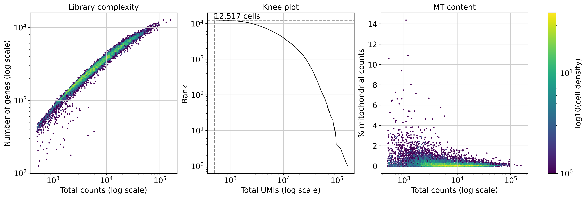</td>
    <td>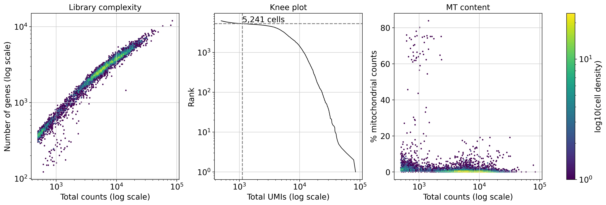</td>
  </tr>
</table>
<br>

### Identify MT outliers

After generating the `combined.h5ad` file, the next step is to annotate it with mitchondrial (MT) metrics. The `--nmads` parameters sets the number of median absolute deviations as a threshold for which to label cells as MT outliers. This outputs a new `h5ad` file in `scribble/adata`.

```bash
# Scribble: MT QC
sbatch -p uoa-compute --ntasks 1 --cpus-per-task 1 --mem 4G --time=2:00:00 \
    -o ${SCRATCH}/logs/sc_mt.%j.out -e ${SCRATCH}/logs/sc_mt.%j.err \
    scribble mt \
    --project_dir ${SCRATCH} \
    --input ${SCRATCH}/scribble/adata/combined.h5ad \
    --nmads 8
```

<br>
<table>
  <tr>
    <td>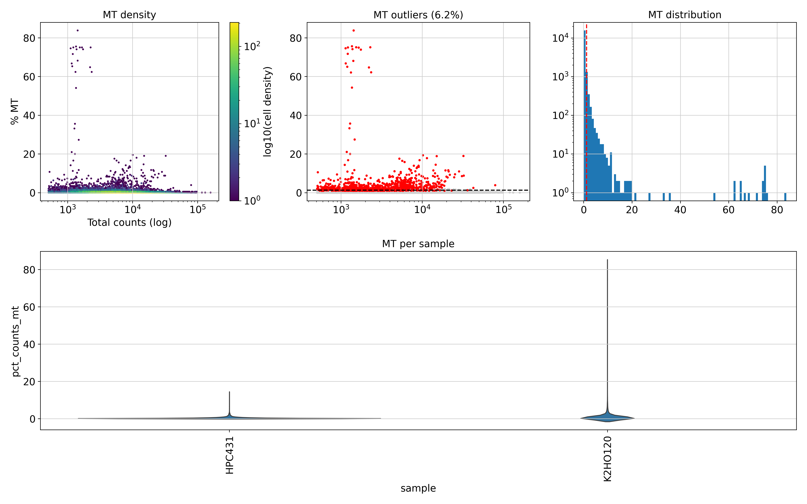</td>
  </tr>
</table>
<br>

### Identify doublets

Net we need to label doublets. Here we run `dbl` in `hybrid` mode to apply both quantile and `scrublet` methods, with an expected doublet fraction of `0.07` and minimum cell count of 200 for a sample to be processed with scrublet. This outputs a new `h5ad` file in `scribble/adata`.

```bash
# Scribble: Doublet QC
sbatch -p uoa-compute --ntasks 1 --cpus-per-task 1 --mem 32G --time=2:00:00 \
    -o ${SCRATCH}/logs/sc_dbl.%j.out -e ${SCRATCH}/logs/sc_dbl.%j.err \
    scribble dbl \
    --project_dir ${SCRATCH} \
    --input ${SCRATCH}/scribble/adata/combined_mtqc_nMADs-8.h5ad \
    --expected 0.07 \
    --mode hybrid \
    --min_cells 200
```

<br>
<table>
  <tr>
    <td>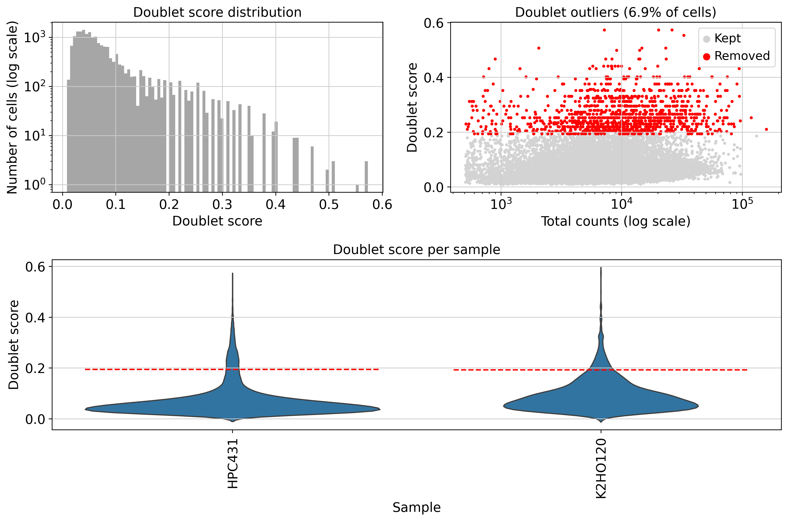</td>
  </tr>
  <tr>
    <td>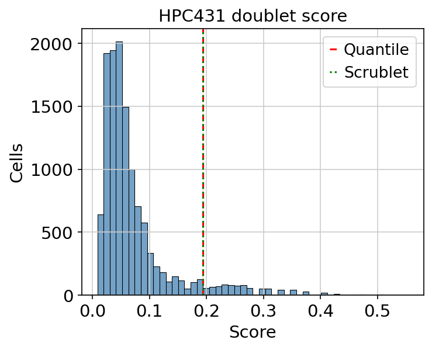</td>
    <td>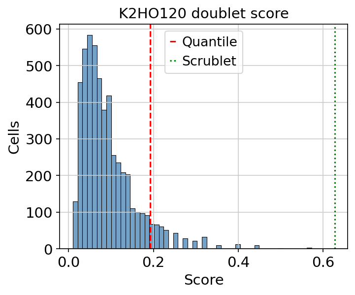</td>
  </tr>
</table>
<br>


### Visually evaluate QC effects

After annotating MT and doublets, we generate a PCA based on a subset of highly variable genes `hvgs` to visually evaluate the QC effects in PCA space. This applies filtering to remove cells labeled as MT outliers or doublets, and applies min `mingens` and max `maxgenes` thresholds to n_genes_by_counts - the number of genes where count > 0 in a cell. A low n_genes_by_counts value indicates a low quality-cell or empty droplet, whilst a very high n_genes_by_counts value can be indicative of a doublet. It returns before and after PCA plots showing log10 counts, doubelt score and %MT.

``` bash
# Scribble: PCA before/after
sbatch -p uoa-compute --ntasks 1 --cpus-per-task 1 --mem 16G --time=2:00:00 \
    -o ${SCRATCH}/logs/sc_pca.%j.out -e ${SCRATCH}/logs/sc_pca.%j.err \
    scribble pca \
    --project_dir ${SCRATCH} \
    --input ${SCRATCH}/scribble/adata/combined_mtqc_nMADs-8_dblqc_exp-0.07.h5ad \
    --mingenes 100 \
    --maxgenes 9000 \
    --hvgs 3000 \
    --vmax 0.99
```

<br>
<table>
  <tr>
    <td>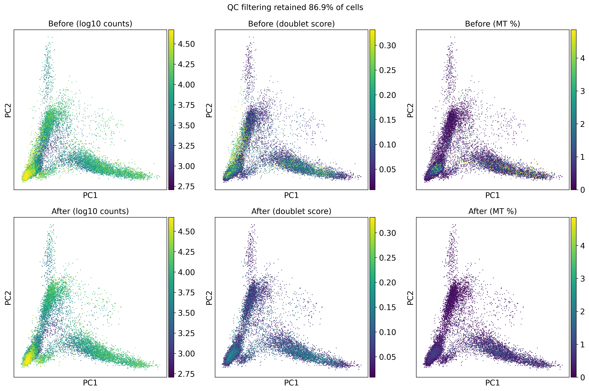</td>
  </tr>
</table>
<br>


### Apply filtering

Having reviewed the results, we next filter the data. Here we pass an `xlsx` file which has a `filters` workseet containing fields for `sample`, `min_genes` and `max_genes`. This enables sample-specific filtering thresholds. Alternatively, fixed thresholds could be applied across all samples by setting `--mingenes` and `--maxgenes`. This outputs a new `h5ad` file in `scribble/adata`.

```bash
# Filtering
sbatch -p uoa-compute --ntasks 1 --cpus-per-task 1 --mem 4G --time=2:00:00 \
    -o ${SCRATCH}/logs/sc_filter.%j.out -e ${SCRATCH}/logs/sc_filter.%j.err \
    scribble filter \
    --project_dir ${SCRATCH} \
    --input ${SCRATCH}/scribble/adata/combined_mtqc_nMADs-8_dblqc_exp-0.07.h5ad \
    --filter_xlsx ${SCRATCH}/samples.xlsx
```

### Pre-integration processing

Prior to batch interration, we run the `preintegration` tool to pre-process the data. This step preserves raw counts and metadata to avoid later loss during any transformations. It emoves genes expressed in too few cells (n = 3) to reduce noise and sparsity. It calculates HVGs, performs normalisation and log transformation and then subsets the data to the HVGs. It can optionally perform regression to remove effets of covariates, e.g. depth and %MT, and scales data to standardise gene expression (use `--no-scale` to disable). It then performs PCA, generates a KNN graph, and plots UMAP(s) cololured by the specified variables `vars`. This outputs a new `h5ad` file in `scribble/adata`.

```bash
# Pre-integration checks
sbatch -p uoa-compute --ntasks 1 --cpus-per-task 1 --mem 4G --time=2:00:00 \
    -o ${SCRATCH}/logs/sc_preintegration.%j.out -e ${SCRATCH}/logs/sc_preintegration.%j.err \
    scribble preintegration \
    --project_dir ${SCRATCH} \
    --input ${SCRATCH}/scribble/adata/combined_mtqc_nMADs-8_dblqc_exp-0.07_filtered.h5ad \
    --min_cells_per_gene 3 \
    --hvgs 3000 \
    --npcs 50 \
    --neighbors 15 \
    --batch sample \
    --vars sample \
    --regress total_counts pct_counts_mt
```

<br>
<table>
  <tr>
    <td>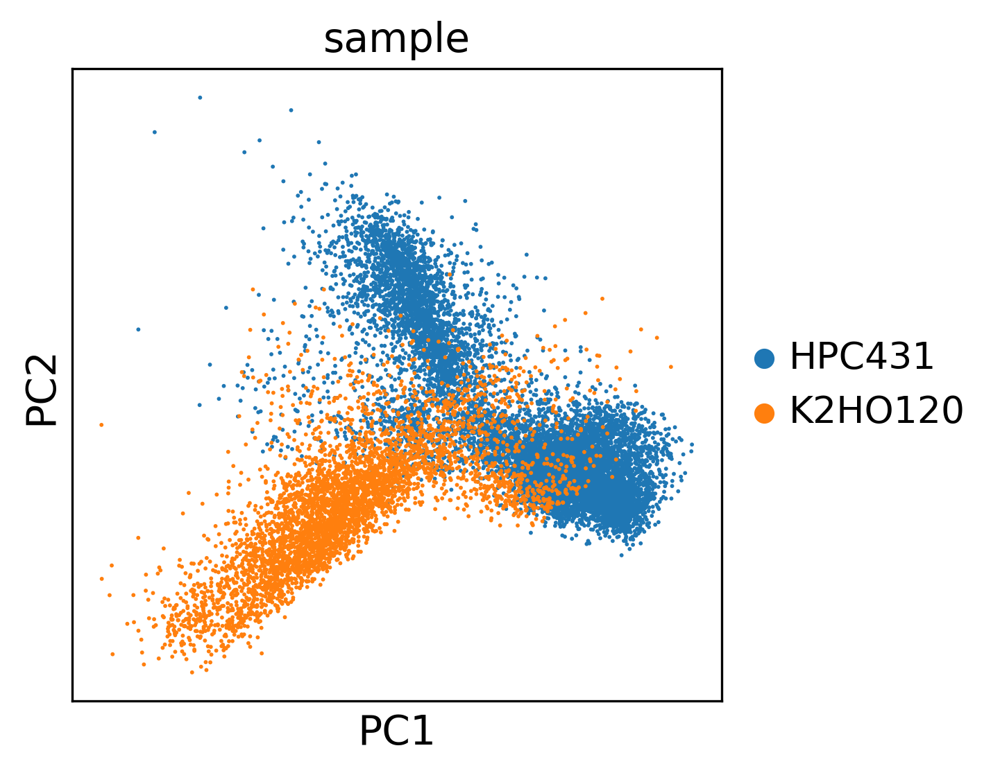</td>
    <td>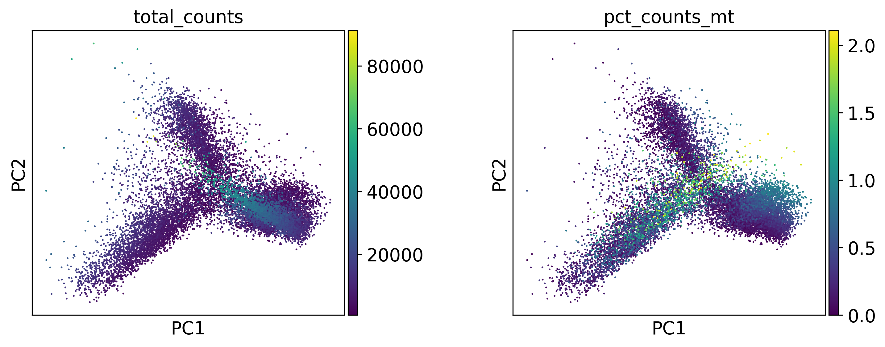</td>
  </tr>
  <tr>
    <td>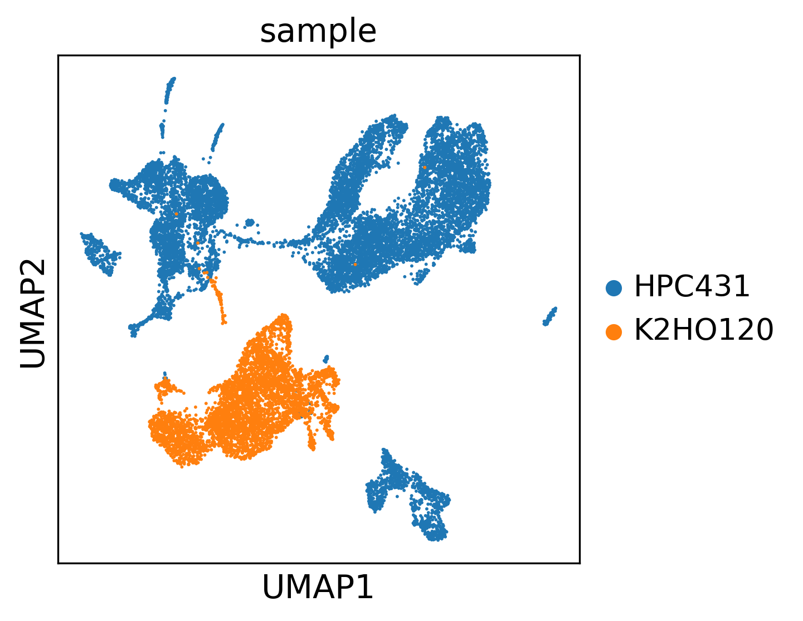</td>
  </tr>
</table>
<br>


### Batch integration

The data is then ready for batch-interation. Currently this is achieved using `Harmony`. To determine the optimal theta for a given dataset, it is necessary to repeat this process for a range of `theta` values. This outputs a new `h5ad` file in `scribble/adata`.

```bash
thetas=(3 6 9 12)
for theta in ${thetas[@]}
do
    # Integration
    sbatch -p uoa-compute --ntasks 1 --cpus-per-task 1 --mem 4G --time=2:00:00 \
        -o ${SCRATCH}/logs/sc_harmony.%j.out -e ${SCRATCH}/logs/sc_harmony_%j.err \
        scribble harmony \
        --project_dir ${SCRATCH} \
        --input ${SCRATCH}/scribble/adata/combined_mtqc_nMADs-8_dblqc_exp-0.07_filtered_preintegration.h5ad \
        --npcs 50 \
        --neighbors 15 \
        --theta ${theta} \
        --batch sample \
        --vars sample
done
```

<br>
<table>
  <tr>
    <td>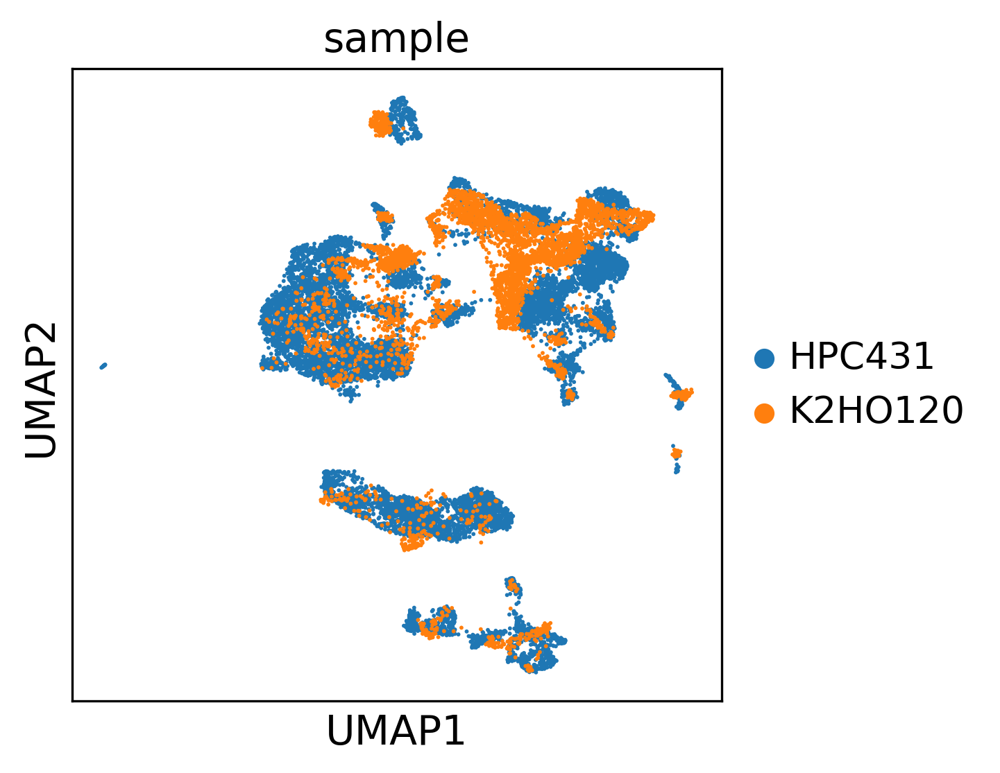</td>
  </tr>
</table>
<br>


### Clustering

Once the integration runs have completed, they are processed to perform Leiden clustering. The optimal resolution can be determined using the `--auto_resolution` method. This requires specifying the lower `--res_min` and upper `--res_max` bounds for the resolution, and the number of resolutions `--res_steps` to test within that range. A silhouette score is calculated from each run and the optimal coarse resolution determined by comparing these scores. That resolution is then used as an anchor to refine resolution based on a `--fine_width`, e.g. if the optimal coarse resolution is 1.0 and `--fine_width 0.2` with `--res_steps 10` then the fine resolution search will have a lower bound of `1.0-0.2`, an upper bound of `1.0+0.2`, and test `10` resolutions within that range. As with the coarse resolution run, silhouette score are calculated for each resolution and the optimal identified and used for clustering. Clustering is performed for `n_repeats`, and the cell to cluster stabiility recorded along with cluster entropy (sample mixing). After clustering, cluster makers are identified for the top `--nmarkers` based on Wilcoxon P value, % expression difference, and log fold change, thereby prioritising significance and specificity of the markers.

```bash
# Once integration compete, cluster
for theta in ${thetas[@]}
do
    # Clustering on Harmony-integrated data
    sbatch -p uoa-compute --ntasks 1 --cpus-per-task 1 --mem 16G --time=2:00:00 \
        -o ${SCRATCH}/logs/sc_cluster.%j.out -e ${SCRATCH}/logs/sc_cluster_%j.err \
        scribble cluster \
        --project_dir ${SCRATCH} \
        --input ${SCRATCH}/scribble/adata/combined_mtqc_nMADs-8_dblqc_exp-0.07_filtered_preintegration_harmony_theta-${theta}.h5ad \
        --embedding X_pca_harmony \
        --neighbors 15 \
        --auto_resolution \
        --res_min 0.2 \
        --res_max 2.0 \
        --res_steps 10 \
        --fine_width 0.3 \
        --vars sample cluster_stability \
        --n_repeats 10 \
        --nmarkers 100
done
```

<br>
<table>
  <tr>
    <td>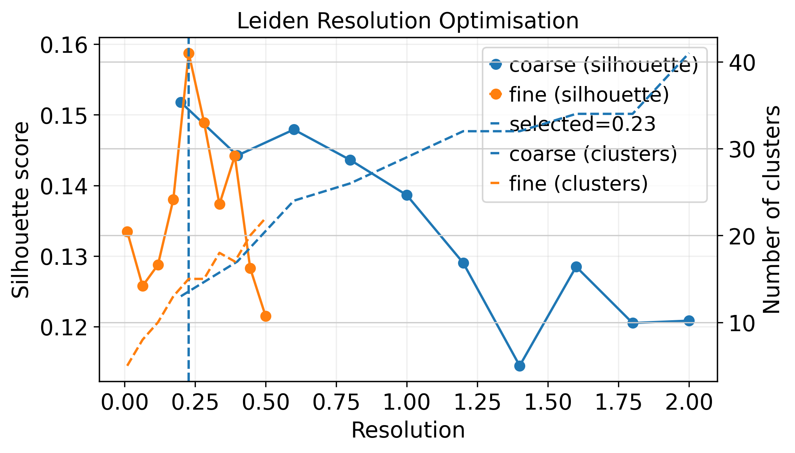</td>
    <td>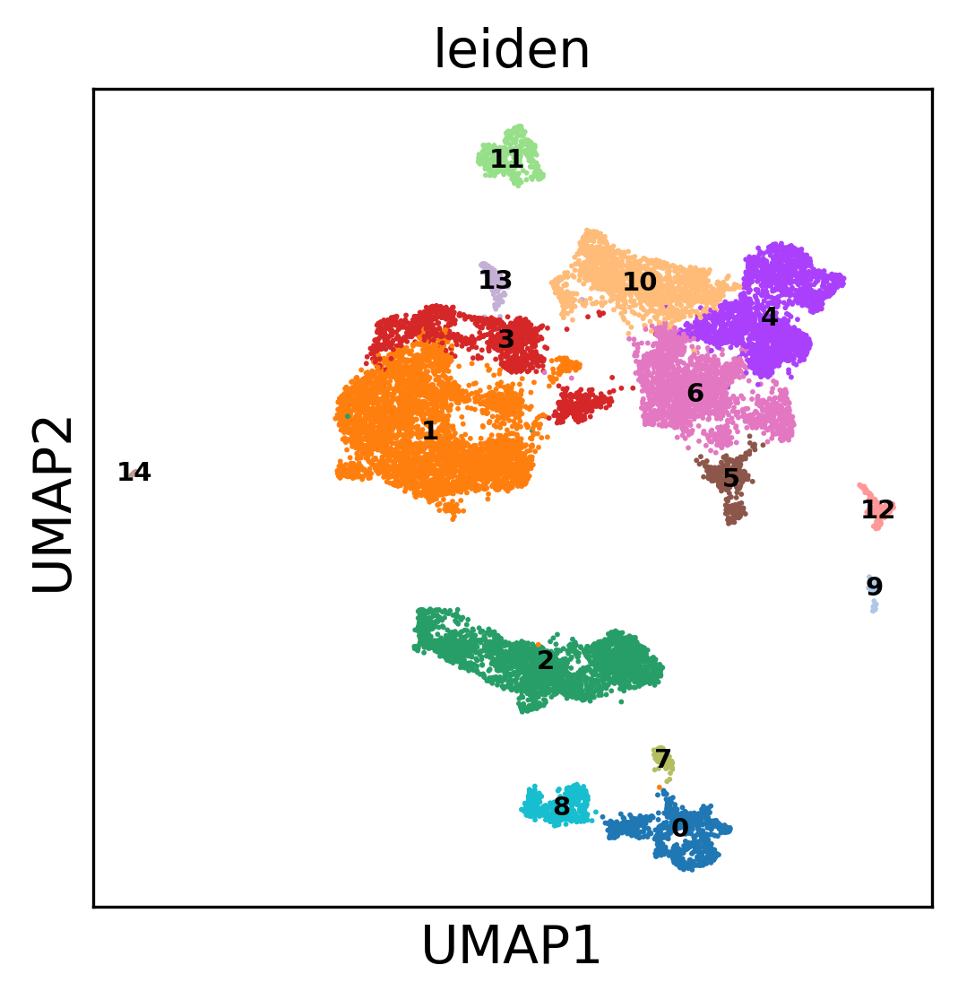</td>
  </tr>
  <tr>
    <td>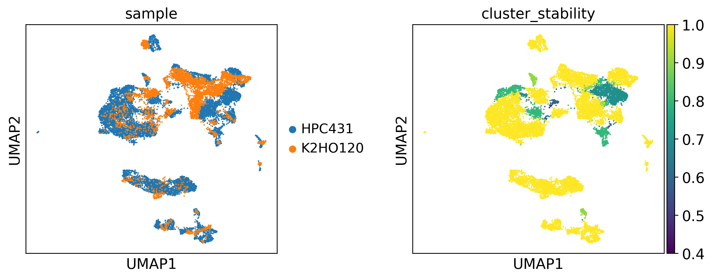</td>
  </tr>
</table>
<br>


### Evaluate clustering

The resulting `cluster_summary.tsv` outputs are then imported to the `evluate` tool. This tool evaluates clustering quality, suggests clusters to merge or subset, and outputs a decision table `cluster_summary_decisions.tsv`. Results are scored based on mean stability, mean entropy, low stabiility fraction, and a cluster penalty (if too few or too many clusters). The best score favours high stability, good mixing, few unstable clusters, and a reasonable cluster number.

```bash
# Evaluate clustering
INPUTS=(${SCRATCH}/scribble/tables/*harmony*cluster_summary.tsv)
scribble evaluate \
    --project_dir ${SCRATCH} \
    --input ${INPUTS[@]} \
    --min_cells 200 \
    --large_cells 800 \
    --low_stability 0.75 \
    --high_stability 0.95 \
    --low_entropy 0.5 \
    --merge_size_ratio 2.5 \
    --merge_stability_tol 0.1 \
    --merge_entropy_tol 0.2
```

### Refine clustering

The `cluster_summary_decisions.tsv` file can then be parsed to refine the clustering. This fully re-processes the cells from clusters that are tagged for subset or merging. Briefly, it subsets the cells, identifies HVGs, runs normalisation, etc.., re-integration with Harmony, clustering, builds hierarchical cluster labels and extracts refined markers (within lineage and global).

```bash
# Refine clusters
theta=9 # optimal
sbatch -p uoa-compute --ntasks 1 --cpus-per-task 1 --mem 16G --time=2:00:00 \
    -o ${SCRATCH}/logs/sc_refine.%j.out -e ${SCRATCH}/logs/sc_refine_%j.err \
    scribble refine \
        --project_dir ${SCRATCH} \
        --decisions ${SCRATCH}/scribble/tables/combined_mtqc_nMADs-8_dblqc_exp-0.07_filtered_preintegration_harmony_theta-${theta}_cluster_summary_decisions.tsv \
        --input ${SCRATCH}/scribble/adata/combined_mtqc_nMADs-8_dblqc_exp-0.07_filtered_preintegration_harmony_theta-${theta}_clustered.h5ad \
        --min_cells_per_gene 3 \
        --batch sample \
        --hvgs 3000 \
        --npcs 50 \
        --neighbors 15 \
        --theta 7 \
        --auto_resolution \
        --res_min 0.1 \
        --res_max 1.5 \
        --res_steps 10 \
        --fine_width 0.2 \
        --min_cells_per_group 500 \
        --n_repeats 10 \
        --nmarkers 100 \
        --max_refine_depth 5 \
        --stability_threshold 0.9 \
        --min_cells_per_cluster 50 \
        --marker_strength_threshold 1.0
```
