# Hippocampal foetal organoid snRNA-seq

Here we take 10X snRNA-seq data of developing hippocampal tissue and of an organoid, and use `scribble` to pre-process both datasets, integrate and cluster for downstream annotation.


## Generate velocyto loom files

Velocyto requires an older version of Python (3.8) to install cleanly. So we create an env to support this.

```bash
mamba create --name velocyto python=3.8
mamba activate velocyto
mamba install numpy scipy cython numba matplotlib scikit-learn h5py click pysam scvelo
pip install velocyto
```

Next, we run velocyto to generate spliced and unspliced count matrices from the 10X BAM output. The `velocyto.sh` script reference below is provided in the `scribble/scripts` floder. In the below example, the HPC431 sample is processed, the `BAM` and `BARCODES` file paths should be updated to process each sample independently.

```bash
mamba activate velocyto
PROJECT=/uoa/home/s14dw4/sharedscratch/KangLab/hippocampus
BAM=${PROJECT}/cellranger/HPC431/outs/possorted_genome_bam.bam
BARCODES=${PROJECT}/cellranger/HPC431/outs/filtered_feature_bc_matrix/barcodes.tsv.gz
GENES=/uoa/home/s14dw4/sharedscratch/software/cellranger-10.0.0/refdata-gex-GRCh38-2024-A/genes/genes.gtf
RPT=/uoa/home/s14dw4/sharedscratch/software/cellranger-10.0.0/refdata-gex-GRCh38-2024-A/GRCh38.rpt.gtf
mkdir -p ${PROJECT}/velocyto

sbatch --partition uoa-compute \
    -o ${PROJECT}/logs/velo.%j.out \
    -e ${PROJECT}/logs/velo.%j.err \
    /uoa/home/s14dw4/sharedscratch/scripts/velocyto.sh \
        --barcodes ${BARCODES} \
        --out ${PROJECT}/velocyto \
        --repeats ${RPT} \
        --bam ${BAM} \
        --genes ${GENES}
```

<br>
<br>

## Pre-process foetal tissue data with scribble

<br>

### Import data

I have `scribble` installed in an env which uses `python=3.12`, and in which `torch` was installed whilst connected to a GPU node. The import tool expects an `xlsx` file containing the worksheet `meta`, which includes the column `sample` whose values match the sample names provided to `--samples`, which should also be directories in the cellranger and velocyto directories. After importing the data and appending the metadata, a `combined.h5ad` file is written to the `scribble/adata` directory in `--project_dir`.

```bash
mamba activate scribble

SCRATCH=/uoa/home/s14dw4/sharedscratch/KangLab/hippocampus

SAMPLES=(FH451 HPC431)

# Scribble: import data
sbatch -p uoa-compute --ntasks 1 --cpus-per-task 1 --mem 24G --time=4:00:00 \
    -o ${SCRATCH}/logs/sc_import.%j.out -e ${SCRATCH}/logs/sc_import.%j.err \
    scribble import \
    --project_dir ${SCRATCH}/tissue \
    --cellranger_dir ${SCRATCH}/cellranger \
    --velocyto_dir ${SCRATCH}/velocyto \
    --metadata_file ${SCRATCH}/samples.xlsx \
    --samples ${SAMPLES[@]}
```

<br>
<table>
  <tr>
    <td>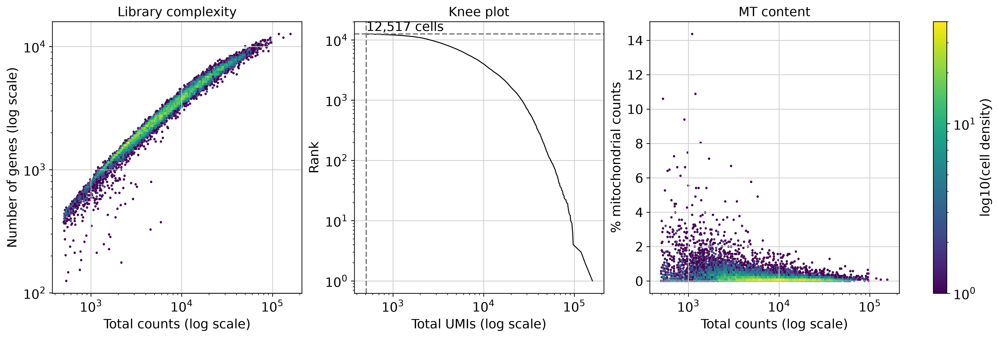</td>
  </tr>
  <tr>
    <td>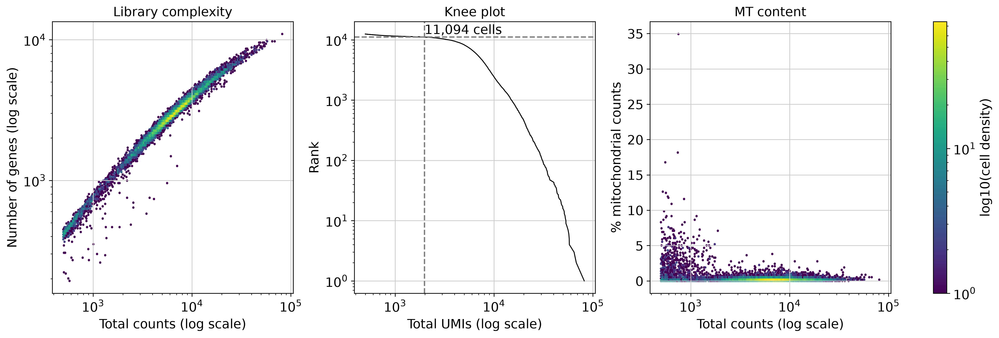</td>
  </tr>
</table>

<br>

### Identify MT outliers

After generating the `combined.h5ad` file, the next step is to annotate it with mitchondrial (MT) metrics. The `--nmads` parameters sets the number of median absolute deviations as a threshold for which to label cells as MT outliers. This outputs a new `h5ad` file in `scribble/adata`.

```bash
# Scribble: MT QC
sbatch -p uoa-compute --ntasks 1 --cpus-per-task 1 --mem 4G --time=2:00:00 \
    -o ${SCRATCH}/logs/sc_mt.%j.out -e ${SCRATCH}/logs/sc_mt.%j.err \
    scribble mt \
    --project_dir ${SCRATCH}/tissue \
    --input ${SCRATCH}/tissue/scribble/adata/combined.h5ad \
    --nmads 8
```

<br>
<table>
  <tr>
    <td>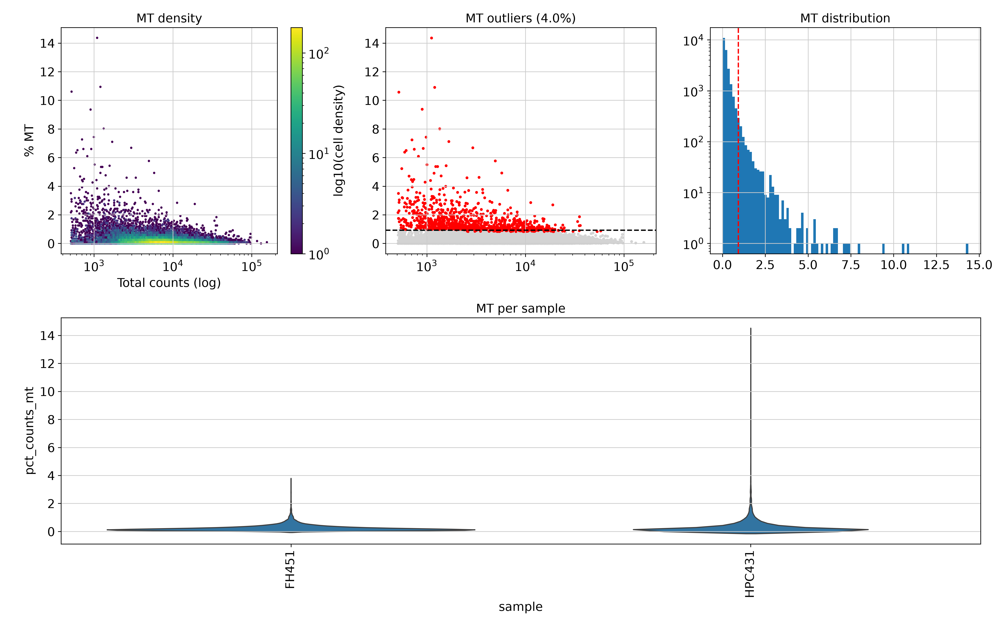</td>
  </tr>
</table>

<br>

### Identify doublets

Net we need to label doublets. Here we run `dbl` in `hybrid` mode to apply both quantile and `scrublet` methods, with an expected doublet fraction of `0.07` and minimum cell count of 200 for a sample to be processed with scrublet. This outputs a new `h5ad` file in `scribble/adata`.

```bash
# Scribble: Doublet QC
sbatch -p uoa-compute --ntasks 1 --cpus-per-task 1 --mem 32G --time=2:00:00 \
    -o ${SCRATCH}/logs/sc_dbl.%j.out -e ${SCRATCH}/logs/sc_dbl.%j.err \
    scribble dbl \
    --project_dir ${SCRATCH}/tissue \
    --input ${SCRATCH}/tissue/scribble/adata/combined_mtqc_nMADs-8.h5ad \
    --expected 0.07 \
    --mode hybrid \
    --min_cells 200
```

<br>
<table>
  <tr>
    <td>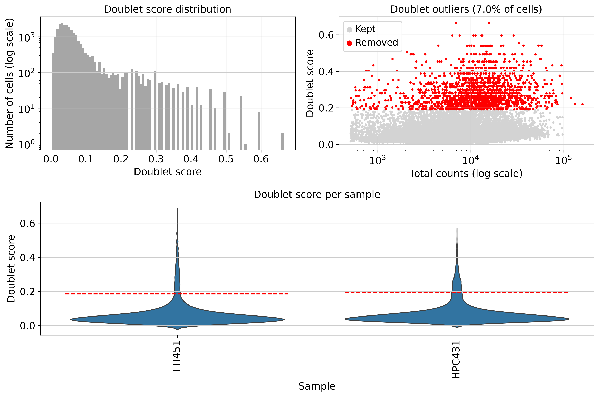</td>
  </tr>
</table>
<table>
  <tr>
    <td>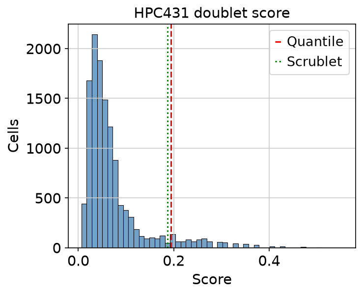</td>
    <td>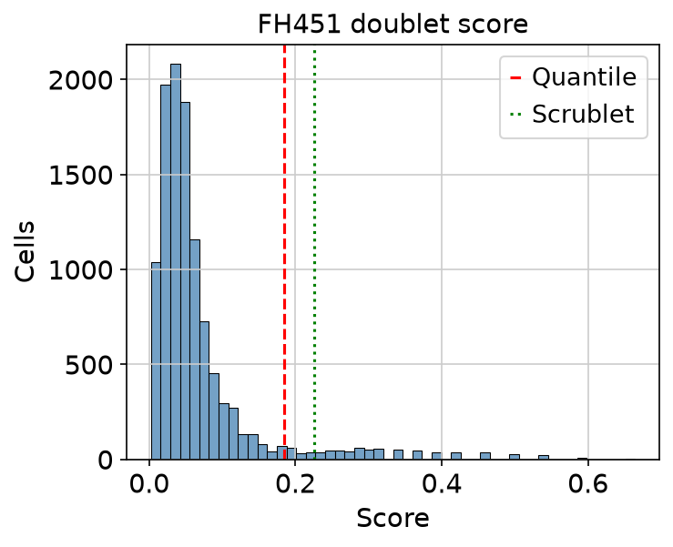</td>
  </tr>
</table>

<br>

### Visually evaluate QC effects

After annotating MT and doublets, we generate a PCA based on a subset of highly variable genes `hvgs` to visually evaluate the QC effects in PCA space. This applies filtering to remove cells labeled as MT outliers or doublets, and applies min `mingens` and max `maxgenes` thresholds to n_genes_by_counts - the number of genes where count > 0 in a cell. A low n_genes_by_counts value indicates a low quality-cell or empty droplet, whilst a very high n_genes_by_counts value can be indicative of a doublet. It returns before and after PCA plots showing log10 counts, doubelt score and %MT.

``` bash
# Scribble: PCA before/after
sbatch -p uoa-compute --ntasks 1 --cpus-per-task 1 --mem 16G --time=2:00:00 \
    -o ${SCRATCH}/logs/sc_pca.%j.out -e ${SCRATCH}/logs/sc_pca.%j.err \
    scribble pca \
    --project_dir ${SCRATCH}/tissue \
    --input ${SCRATCH}/tissue/scribble/adata/combined_mtqc_nMADs-8_dblqc_exp-0.07.h5ad \
    --mingenes 100 \
    --maxgenes 9000 \
    --hvgs 3000 \
    --vmax 0.99
```

<br>
<table>
  <tr>
    <td>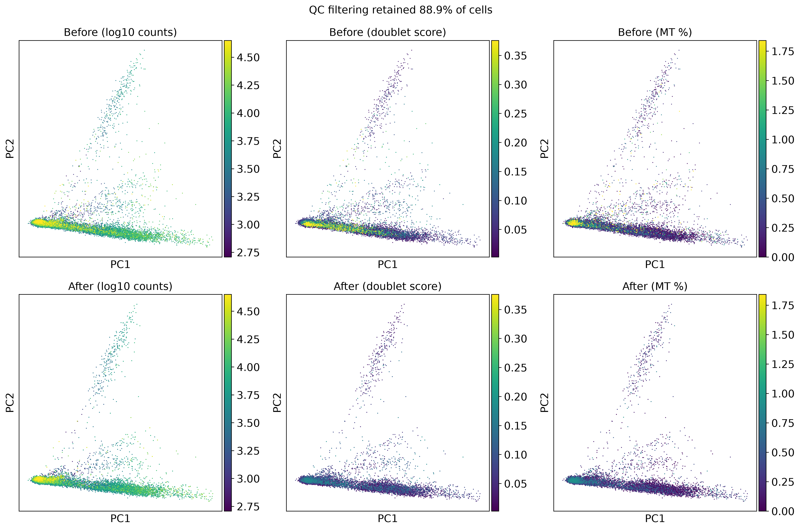</td>
  </tr>
</table>

<br>

### Apply filtering

Having reviewed the results, we next filter the data. Here we apply the same min and max gene thresholds to both samples by setting `--mingenes` and `--maxgenes`. This outputs a new `h5ad` file in `scribble/adata`.

```bash
# Filtering
sbatch -p uoa-compute --ntasks 1 --cpus-per-task 1 --mem 4G --time=2:00:00 \
    -o ${SCRATCH}/logs/sc_filter.%j.out -e ${SCRATCH}/logs/sc_filter.%j.err \
    scribble filter \
    --project_dir ${SCRATCH}/tissue \
    --input ${SCRATCH}/tissue/scribble/adata/combined_mtqc_nMADs-8_dblqc_exp-0.07.h5ad \
    --mingenes 200 \
    --maxgenes 10000
```

<bt>

### Pre-integration processing

Prior to batch interration, we run the `preintegration` tool to pre-process the data. This step preserves raw counts and metadata to avoid later loss during any transformations. It emoves genes expressed in too few cells (n = 3) to reduce noise and sparsity. It calculates HVGs, performs normalisation and log transformation and then subsets the data to the HVGs. It can optionally perform regression to remove effets of covariates, e.g. depth and %MT, and scales data to standardise gene expression (use `--no-scale` to disable). It then performs PCA, generates a KNN graph, and plots UMAP(s) cololured by the specified variables `vars`. This outputs a new `h5ad` file in `scribble/adata`.

```bash
# Pre-integration checks
sbatch -p uoa-compute --ntasks 1 --cpus-per-task 1 --mem 16G --time=2:00:00 \
    -o ${SCRATCH}/logs/sc_preintegration.%j.out -e ${SCRATCH}/logs/sc_preintegration.%j.err \
    scribble preintegration \
    --project_dir ${SCRATCH}/tissue \
    --input ${SCRATCH}/tissue/scribble/adata/combined_mtqc_nMADs-8_dblqc_exp-0.07_filtered.h5ad \
    --min_cells_per_gene 3 \
    --hvgs 3000 \
    --npcs 50 \
    --neighbors 15 \
    --regress total_counts pct_counts_mt
```

<br>
<table>
  <tr>
    <td>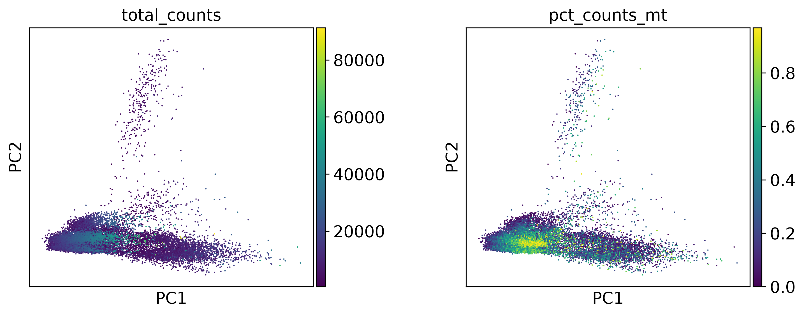</td>
  </tr>
</table>
<table>
  <tr>
    <td>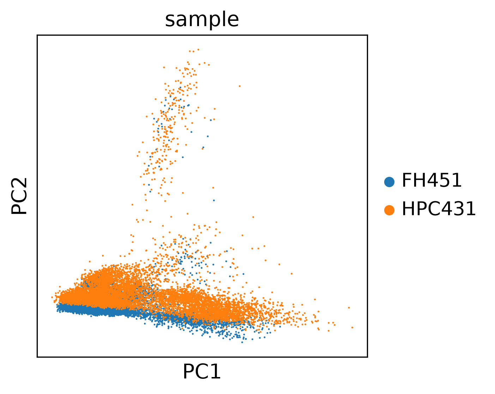</td>
    <td>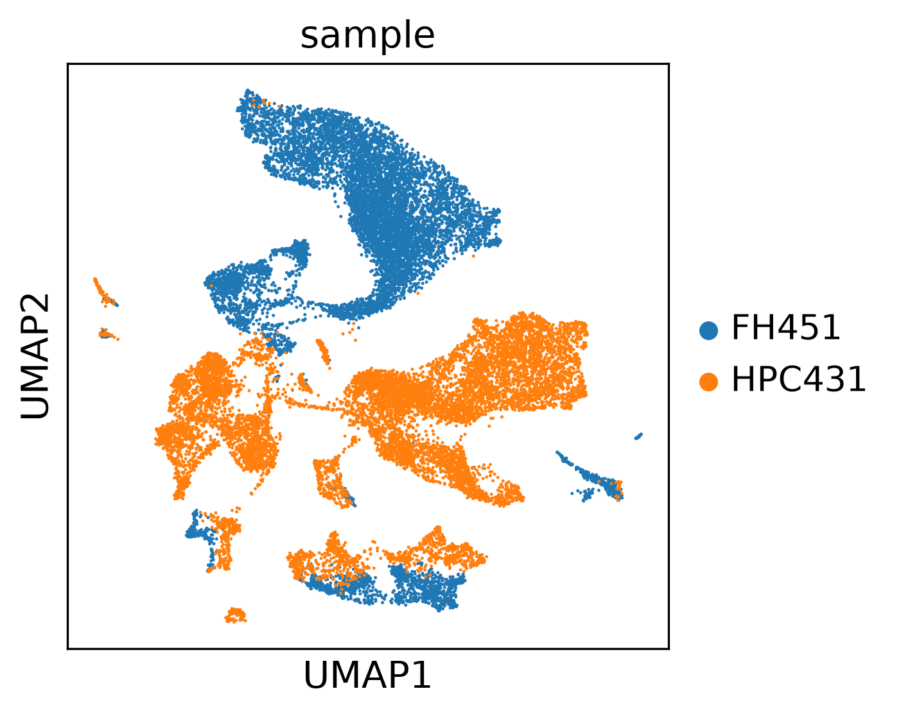</td>
  </tr>
</table>

<br>

### Batch integration

The data is then ready for batch-interation. Currently this is achieved using `Harmony`. To determine the optimal theta for a given dataset, it is necessary to repeat this process for a range of `theta` values, and is equally worth considering a range of principal components and nearest neighbours. This outputs a new `h5ad` file per combination of parameters in `scribble/adata` and umaps in `scribble/plots`.

```bash
thetas=(1 2 3)
ks=(15 20 30)
npcs=(20 30)
for theta in ${thetas[@]}
do
    for k in ${ks[@]}
    do
        for n in ${npcs[@]}
        do
            # Integration
            sbatch -p uoa-compute --ntasks 1 --cpus-per-task 1 --mem 16G --time=12:00:00 \
                -o ${SCRATCH}/logs/sc_harmony.%j.out -e ${SCRATCH}/logs/sc_harmony_%j.err \
                scribble harmony \
                --project_dir ${SCRATCH}/tissue \
                --input ${SCRATCH}/tissue/scribble/adata/combined_mtqc_nMADs-8_dblqc_exp-0.07_filtered_preintegration.h5ad \
                --npcs ${n} \
                --neighbors ${k} \
                --theta ${theta} \
                --batch sample \
                --vars sample
        done
    done
done
```

Example UMAPs following integration with `--npcs 20 --neighbours 15 --theta 1` and `--npcs 30 --neighbours 30 --theta 2` are shown below.

<br>
<table>
  <tr>
    <td>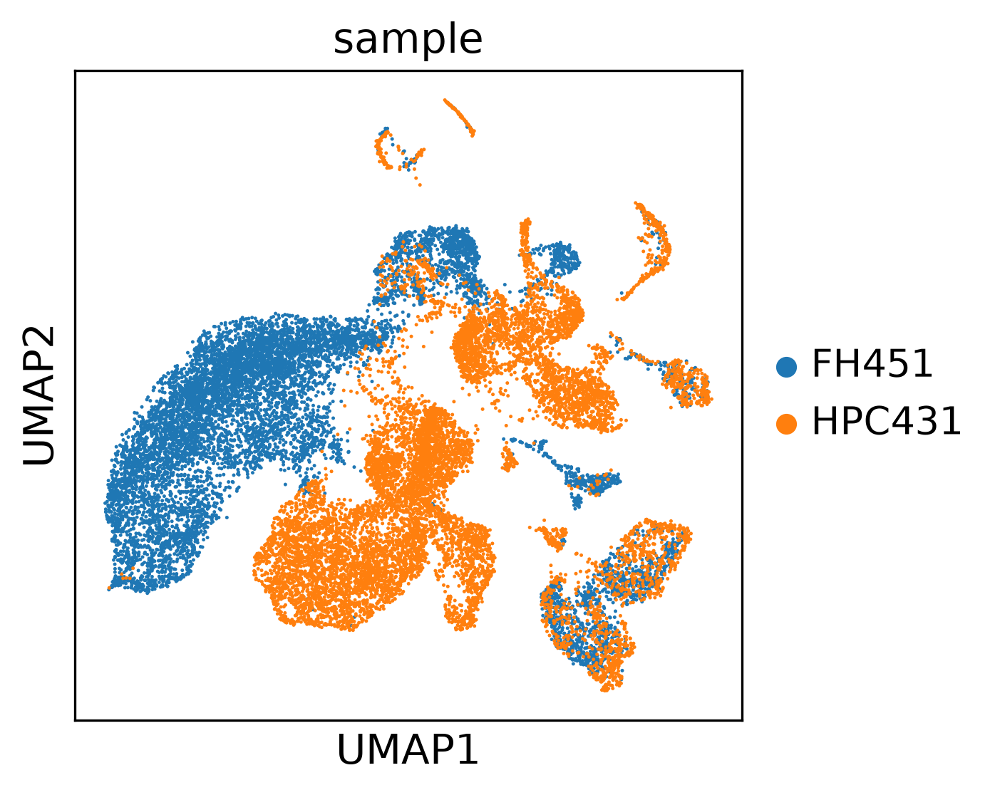</td>
    <td>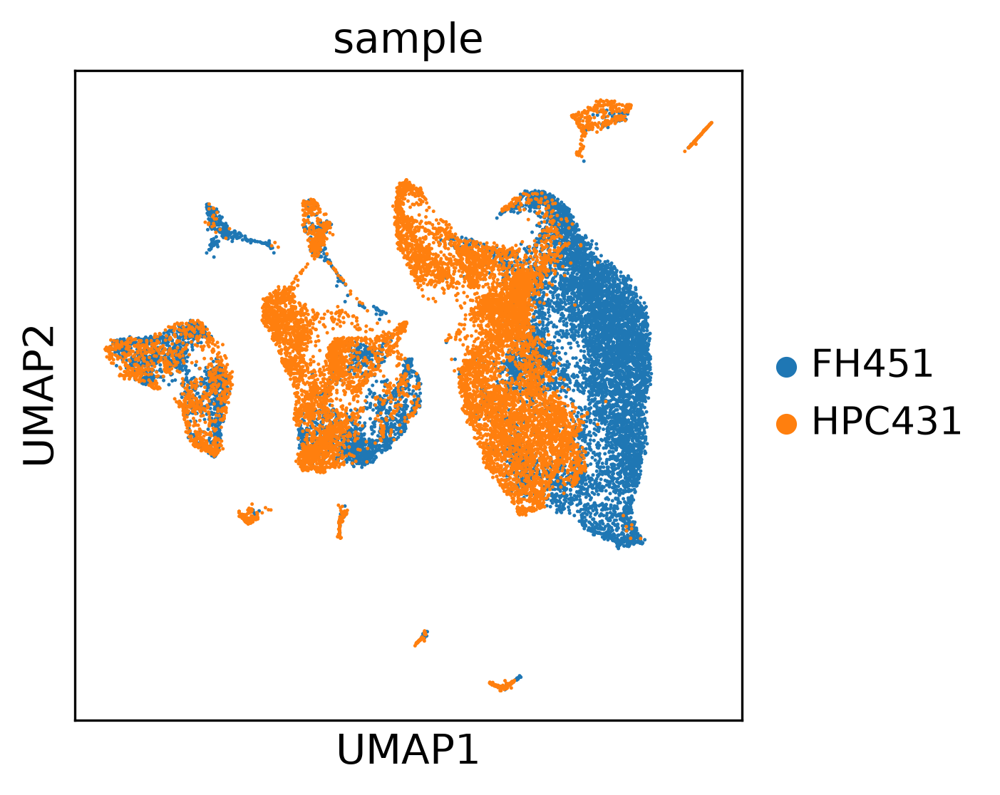</td>
  </tr>
</table>

<br>

### Clustering

Once the integration runs have completed, they are processed to perform Leiden clustering. The optimal resolution can be determined using the `--auto_resolution` method. This requires specifying the lower `--res_min` and upper `--res_max` bounds for the resolution, and the number of resolutions `--res_steps` to test within that range. A silhouette score is calculated from each run and the optimal coarse resolution determined by comparing these scores. That resolution is then used as an anchor to refine resolution based on a `--fine_width`, e.g. if the optimal coarse resolution is 1.0 and `--fine_width 0.2` with `--res_steps 10` then the fine resolution search will have a lower bound of `1.0-0.2`, an upper bound of `1.0+0.2`, and test `10` resolutions within that range. As with the coarse resolution run, silhouette score are calculated for each resolution and the optimal identified and used for clustering. Clustering is performed for `n_repeats`, and the cell to cluster stabiility recorded along with cluster entropy (sample mixing). After clustering, cluster makers are identified for the top `--nmarkers` based on Wilcoxon P value, % expression difference, and log fold change, thereby prioritising significance and specificity of the markers. Two output TSV files are written to `scribble/tables`, one containing a summary of cluster-level statistics and another containing cell-level cluster assignment stability, in addition to an Excel file containing the marker genes per cluster.

```bash
# Once integration compete, cluster
for theta in ${thetas[@]}
do
    for k in ${ks[@]}
    do
        for n in ${npcs[@]}
        do
            # Clustering on Harmony-integrated data
            sbatch -p uoa-compute --ntasks 1 --cpus-per-task 1 --mem 48G --time=6:00:00 \
                -o ${SCRATCH}/logs/sc_cluster.%j.out -e ${SCRATCH}/logs/sc_cluster_%j.err \
                scribble cluster \
                --project_dir ${SCRATCH}/tissue \
                --input ${SCRATCH}/tissue/scribble/adata/combined_mtqc_nMADs-8_dblqc_exp-0.07_filtered_preintegration_harmony_npcs-${n}_k-${k}_theta-${theta}.h5ad \
                --output_prefix combined_npcs-${n}_k-${k}_theta-${theta} \
                --embedding X_pca_harmony \
                --neighbors ${k} \
                --auto_resolution \
                --res_min 0.2 \
                --res_max 2.0 \
                --res_steps 18 \
                --fine_width 0.1 \
                --vars sample cluster_stability \
                --n_repeats 10 \
                --nmarkers 100
        done
    done
done
```

<br>

### Evaluate clustering

The resulting `cluster_summary.tsv` outputs are then imported to the `evaluate` tool. This tool evaluates clustering quality, suggests clusters to merge or subset, and outputs a decision table `cluster_summary_decisions.tsv`. Results are scored based on mean stability, mean entropy, low stabiility fraction, and a cluster penalty (if too few or too many clusters). The best score favours high stability, good mixing, few unstable clusters, and a reasonable cluster number. Clusters that could be merged prior to subsetting are determined based on total graph connectivity between cells in pairs of clusters and a percentile cutoff.

```bash
# Evaluate clustering
INPUTS=($(find ${SCRATCH}/tissue/scribble -type f -name *cluster_summary.tsv))
scribble evaluate \
    --project_dir ${SCRATCH}/tissue \
    --input ${INPUTS[@]} \
    --min_cells 100 \
    --large_cells 800 \
    --low_stability 0.75 \
    --high_stability 0.95 \
    --low_entropy 0 \
    --merge_percentile 90
```

These results indicate `--npcs 30 --neighbours 30 --theta 2` to be return the best score. This score is a composite:

```python
score = (
    mean_stability
    + 0.5 * mean_entropy
    - 2.0 * low_stability_frac
    - 0.1 * cluster_penalty
)
```

The output at command line is shown below.

```bash
Comparison summary:
                                                 file     score  mean_stability  mean_entropy  low_stability_fraction  n_clusters
10  combined_npcs-30_k-30_theta-2_cluster_summary.tsv  1.163324        0.959537      0.407573                0.000000          22
4   combined_npcs-20_k-30_theta-2_cluster_summary.tsv  1.163324        0.959537      0.407573                0.000000          22
7   combined_npcs-30_k-30_theta-1_cluster_summary.tsv  1.135192        0.968204      0.333976                0.000000          15
6   combined_npcs-20_k-30_theta-1_cluster_summary.tsv  1.135192        0.968204      0.333976                0.000000          15
0   combined_npcs-20_k-30_theta-3_cluster_summary.tsv  1.061058        0.941555      0.489006                0.062500          16
13  combined_npcs-20_k-15_theta-2_cluster_summary.tsv  1.053326        0.932363      0.379856                0.034483          29
17  combined_npcs-30_k-15_theta-2_cluster_summary.tsv  1.053326        0.932363      0.379856                0.034483          29
8   combined_npcs-20_k-20_theta-2_cluster_summary.tsv  1.044108        0.927188      0.381989                0.037037          27
15  combined_npcs-30_k-20_theta-2_cluster_summary.tsv  1.030951        0.936199      0.411726                0.055556          18
5   combined_npcs-30_k-15_theta-1_cluster_summary.tsv  0.986511        0.949059      0.265380                0.047619          21
3   combined_npcs-20_k-15_theta-1_cluster_summary.tsv  0.986511        0.949059      0.265380                0.047619          21
11  combined_npcs-30_k-20_theta-1_cluster_summary.tsv  0.977682        0.934337      0.308912                0.055556          18
1   combined_npcs-20_k-20_theta-1_cluster_summary.tsv  0.968222        0.941447      0.303549                0.062500          16
12  combined_npcs-30_k-30_theta-3_cluster_summary.tsv  0.923632        0.929129      0.489006                0.125000          16
9   combined_npcs-30_k-15_theta-3_cluster_summary.tsv  0.915476        0.923998      0.453545                0.117647          17
2   combined_npcs-20_k-15_theta-3_cluster_summary.tsv  0.915476        0.923998      0.453545                0.117647          17
14  combined_npcs-20_k-20_theta-3_cluster_summary.tsv  0.843465        0.918266      0.450399                0.150000          20
16  combined_npcs-30_k-20_theta-3_cluster_summary.tsv  0.843465        0.918266      0.450399                0.150000          20

Selected best clustering → combined_npcs-30_k-30_theta-2_cluster_summary.tsv
Score: 1.1633

Loading cluster summary: /uoa/home/s14dw4/sharedscratch/KangLab/hippocampus/tissue/scribble/tables/combined_npcs-30_k-30_theta-2_cluster_summary.tsv
Merge connectivity cutoff (90.0th percentile): 0.2108
0 <-> 10: 0.0000
0 <-> 4: 0.2067
0 <-> 1: 0.2482
MERGE 0 <-> 1 (score=0.2482)
0 <-> 16: 0.0206
10 <-> 4: 0.0000
10 <-> 1: 0.0522
10 <-> 16: 0.0006
4 <-> 1: 0.0005
4 <-> 16: 0.0192
1 <-> 16: 0.0147
action
keep      17
subset     5
```

The below plots from `scribble cluster` are from this highest scoring run. Note, the cluster labels start at 0.

<br>
<table>
  <tr>
    <td>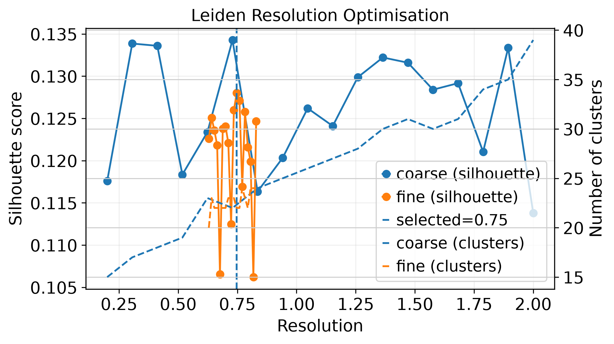</td>
  </tr>
</table>
<table>
    <tr>
    <td>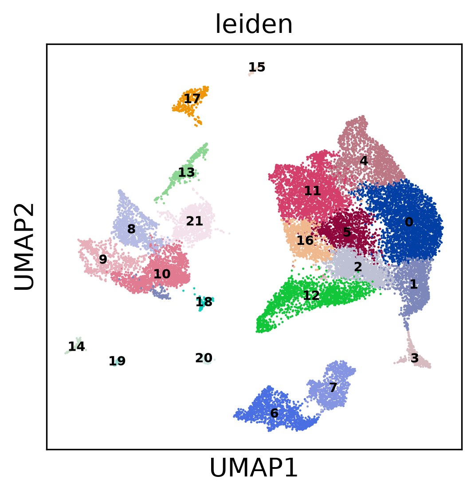</td>
    <td>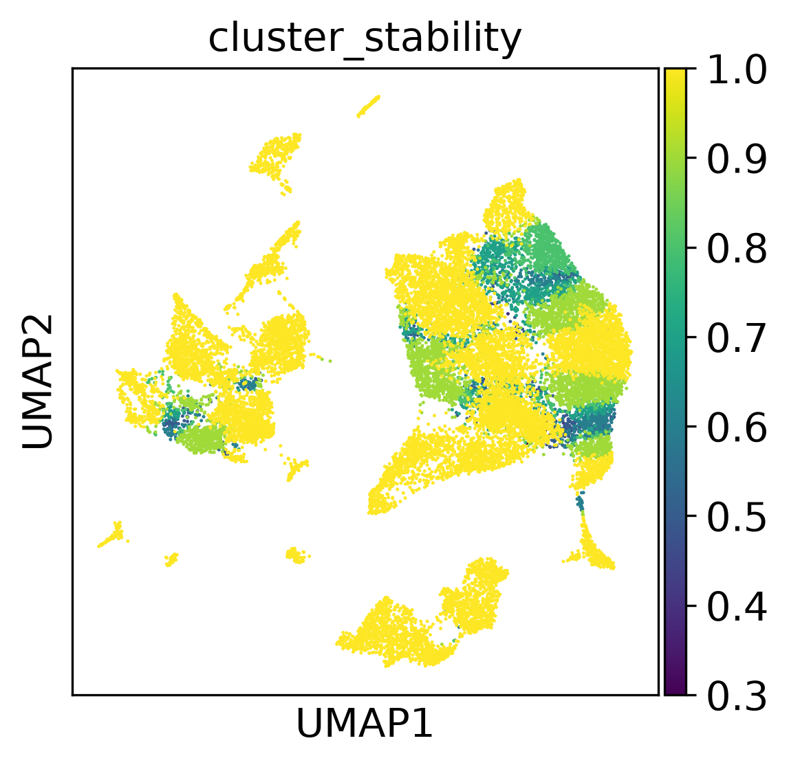</td>
  </tr>
</table>
<br>

The `cluster_summary.tsv` from `scribble cluster` for this run is below and indicates for each cluster a range of metrics. These include the number of cells, mean stability, median stability, fraction of total cells, sample cell counts, entropy, whether the cluster has low stability or low sample mixing, the clustering resolution, embedding used, and number of clustering iterations undertaken.

```tsv
cluster	n_cells	mean_stability	median_stability	fraction	FH451	HPC431	sample_entropy	low_stability	low_mixing	resolution	embedding	n_repeats
0	3329	0.9293181135476118	0.9	0.15826004278583314	3310	19	0.03517556412578142	False	True	0.7470588235294119	X_pca_harmony	10
11	2306	0.9685169124024284	1.0	0.10962681245543142	301	2005	0.38739118137130524	False	True	0.7470588235294119	X_pca_harmony	10
10	1573	0.9341385886840433	1.0	0.0747801283574994	638	935	0.6752149000964861	False	False	0.7470588235294119	X_pca_harmony	10
4	1539	0.7992202729044834	0.8	0.07316377466127882	1525	14	0.05180881064010117	False	True	0.7470588235294119	X_pca_harmony	10
12	1535	0.9954397394136808	1.0	0.07297361540289993	145	1390	0.31274270304125307	False	True	0.7470588235294119	X_pca_harmony	10
2	1495	0.9580602006688963	1.0	0.071072022819111	131	1364	0.29700920694746336	False	True	0.7470588235294119	X_pca_harmony	10
1	1241	0.7736502820306205	0.8	0.058996909912051344	1030	211	0.45592454199442034	False	True	0.7470588235294119	X_pca_harmony	10
6	1172	0.9997440273037543	1.0	0.05571666270501545	686	486	0.6785152262499295	False	False	0.7470588235294119	X_pca_harmony	10
5	1088	0.9630514705882353	1.0	0.05172331827905871	685	403	0.6591705646639232	False	False	0.7470588235294119	X_pca_harmony	10
8	991	0.9989909182643795	1.0	0.04711195626337057	222	769	0.5319442676039675	False	False	0.7470588235294119	X_pca_harmony	10
21	932	0.9984978540772532	1.0	0.04430710720228191	0	932	0.0	False	True	0.7470588235294119	X_pca_harmony	10
7	915	0.9995628415300547	1.0	0.04349893035417162	446	469	0.6928312226501077	False	False	0.7470588235294119	X_pca_harmony	10
16	868	0.8794930875576037	0.9	0.04126455906821963	11	857	0.06795076507615734	False	True	0.7470588235294119	X_pca_harmony	10
9	605	0.9198347107438016	1.0	0.028761587829807464	419	186	0.617035405538228	False	False	0.7470588235294119	X_pca_harmony	10
13	418	1.0	1.0	0.01987164250059425	154	264	0.6581099875431143	False	False	0.7470588235294119	X_pca_harmony	10
17	298	1.0	1.0	0.014166864749227478	34	264	0.35499006010413947	False	True	0.7470588235294119	X_pca_harmony	10
3	290	0.9989655172413793	1.0	0.013786546232469693	271	19	0.24188595379927383	False	True	0.7470588235294119	X_pca_harmony	10
14	101	1.0	1.0	0.004801521274067031	22	79	0.524137206754352	False	False	0.7470588235294119	X_pca_harmony	10
15	100	1.0	1.0	0.004753981459472308	15	85	0.42270908780599087	False	True	0.7470588235294119	X_pca_harmony	10
20	91	1.0	1.0	0.004326123128119801	5	86	0.21282591267100207	False	True	0.7470588235294119	X_pca_harmony	10
18	88	1.0	1.0	0.0041835036843356314	12	76	0.39830711380528416	False	True	0.7470588235294119	X_pca_harmony	10
19	60	0.9933333333333334	1.0	0.0028523888756833847	28	32	0.6909233093138181	False	False	0.7470588235294119	X_pca_harmony	10
```

The `summary_decisions.tsv` output from `scribble evaluate` is provided below. This step classifies clusters based on the number of cells, cluster stability, and entropy. In some datasets a recommendation will be made to subset or merge clusetrs. Here it suggests to merge clustres 0 and 1 when subsetting.

```tsv
cluster	action	reason	detail	priority	merge_group
0	subset	heterogeneous_large_cluster	n=3329; stability=0.93; entropy=0.04	high	group_1
11	keep	well_defined_cluster	n=2306; stability=0.97; entropy=0.39	low
10	subset	heterogeneous_large_cluster	n=1573; stability=0.93; entropy=0.68	high
4	subset	heterogeneous_large_cluster	n=1539; stability=0.80; entropy=0.05	high
12	keep	well_defined_cluster	n=1535; stability=1.00; entropy=0.31	low
2	keep	well_defined_cluster	n=1495; stability=0.96; entropy=0.30	low
1	subset	heterogeneous_large_cluster	n=1241; stability=0.77; entropy=0.46	high	group_1
6	keep	well_defined_cluster	n=1172; stability=1.00; entropy=0.68	low
5	keep	well_defined_cluster	n=1088; stability=0.96; entropy=0.66	low
8	keep	well_defined_cluster	n=991; stability=1.00; entropy=0.53	low
21	keep	well_defined_cluster	n=932; stability=1.00; entropy=0.00	low
7	keep	well_defined_cluster	n=915; stability=1.00; entropy=0.69	low
16	subset	heterogeneous_large_cluster	n=868; stability=0.88; entropy=0.07	high
9	keep	well_defined_cluster	n=605; stability=0.92; entropy=0.62	low
13	keep	well_defined_cluster	n=418; stability=1.00; entropy=0.66	low
17	keep	well_defined_cluster	n=298; stability=1.00; entropy=0.35	low
3	keep	well_defined_cluster	n=290; stability=1.00; entropy=0.24	low
14	keep	well_defined_cluster	n=101; stability=1.00; entropy=0.52	low
15	keep	well_defined_cluster	n=100; stability=1.00; entropy=0.42	low
20	keep	small_cluster	n=91; stability=1.00; entropy=0.21	low
18	keep	small_cluster	n=88; stability=1.00; entropy=0.40	low
19	keep	small_cluster	n=60; stability=0.99; entropy=0.69	low
```

<br>

### Refine clustering

The `cluster_summary_decisions.tsv` file can then be parsed to refine the clustering. This fully re-processes the cells from clusters that are tagged for subset or merging. Briefly, it subsets the cells, identifies HVGs, runs normalisation, etc.., re-integration with Harmony, clustering, refines cluster labels and extracts refined markers (for each cluster subset, and globally after cluster re-assignment). To avoid over-clustering, we limit the resolution to 1.0, and recursively refine clusters to a depth no greater than 2.

```bash
# Refine clusters
sbatch -p uoa-compute --ntasks 1 --cpus-per-task 1 --mem 16G --time=2:00:00 \
    -o ${SCRATCH}/logs/sc_refine.%j.out -e ${SCRATCH}/logs/sc_refine.%j.err \
    scribble refine \
        --project_dir ${SCRATCH}/tissue \
        --decisions ${SCRATCH}/tissue/scribble/tables/combined_npcs-30_k-30_theta-2_cluster_summary_decisions.tsv \
        --input ${SCRATCH}/tissue/scribble/adata/combined_npcs-30_k-30_theta-2_clustered.h5ad \
        --min_cells_per_gene 3 \
        --hvgs 3000 \
        --npcs 20 \
        --neighbors 15 \
        --auto_resolution \
        --res_min 0.1 \
        --res_max 1.0 \
        --res_steps 10 \
        --fine_width 0.1 \
        --min_cells_per_group 100 \
        --n_repeats 10 \
        --nmarkers 100 \
        --max_refine_depth 2 \
        --stability_threshold 0.9 \
        --min_cells_per_cluster 50 \
        --marker_strength_threshold 1.0
```

This returns a UMAP with refined cluster labels in `scribble/plots` and an Excel file containing marker genes per cluster in `scribble/tables`. These should be used for cell type annotation, and any further cluster refinements will need to be made manually by importing the `scribble/adata/*_clustered_refined.h5ad` file into Python for processing.

<br>
<table>
  <tr>
    <td>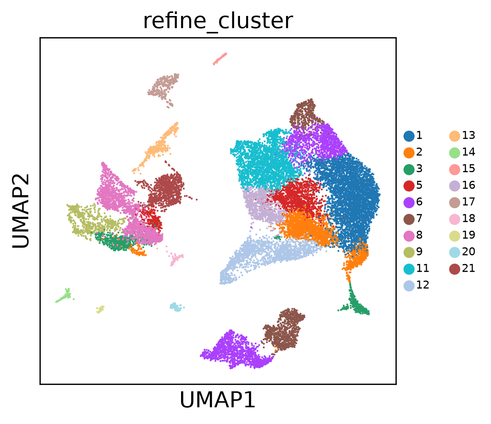</td>
  </tr>
</table>

<br>

### Update with annotations

Cluster annotations should be recorded on an `annotations` worksheet in the Excel file. The worksheet must include a field for `refine_cluster` which should contain values matching the clusters on the refine_cluster UMAP. Additional fields, such as cell type and key markers will be added as metadata. UMAPs and dot plots can be generated based on these values if the corresponding field name is passed to `--plot_markers`. The tool will output a new h5ad file in `scribble/adata` that includes the annotations from the Excel file.

```bash
# Annotate
sbatch -p uoa-compute --ntasks 1 --cpus-per-task 1 --mem 24G --time=1:00:00 \
    -o ${SCRATCH}/logs/sc_annotate.%j.out -e ${SCRATCH}/logs/sc_annotate_%j.err \
    scribble annotate \
        --project_dir ${SCRATCH}/tissue \
        --input ${SCRATCH}/tissue/scribble/adata/combined_npcs-30_k-30_theta-2_clustered_refined.h5ad \
        --annotations ${SCRATCH}/tissue/scribble/samples.xlsx \
        --plot_markers key_markers \
        --label cell_type_minor
```

<br>
<br>


## Pre-process organoid data with scribble

<br>

### Import data

I have `scribble` installed in an env which uses `python=3.12`, and in which `torch` was installed whilst connected to a GPU node. The import tool expects an `xlsx` file containing the worksheet `meta`, which includes the column `sample` whose values match the sample names provided to `--samples`, which should also be directories in the cellranger and velocyto directories. After importing the data and appending the metadata, a `combined.h5ad` file is written to the `scribble/adata` directory in `--project_dir`.

```bash
mamba activate scribble

SCRATCH=/uoa/home/s14dw4/sharedscratch/KangLab/hippocampus

SAMPLES=(K2HO120 K2HO51)

# Scribble: import data
sbatch -p uoa-compute --ntasks 1 --cpus-per-task 1 --mem 24G --time=4:00:00 \
    -o ${SCRATCH}/logs/sc_import.%j.out -e ${SCRATCH}/logs/sc_import.%j.err \
    scribble import \
    --project_dir ${SCRATCH}/organoid \
    --cellranger_dir ${SCRATCH}/cellranger \
    --velocyto_dir ${SCRATCH}/velocyto \
    --metadata_file ${SCRATCH}/samples.xlsx \
    --samples ${SAMPLES[@]}
```

<br>
<table>
  <tr>
    <td>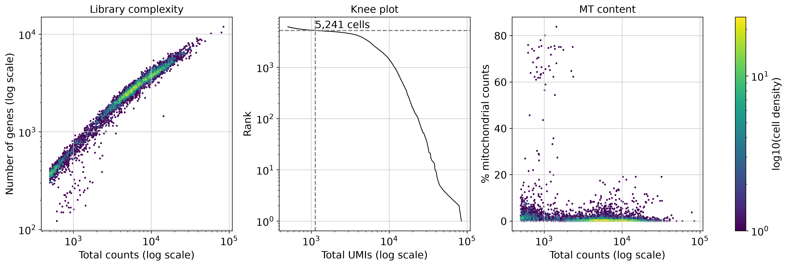</td>
  </tr>
  <tr>
    <td>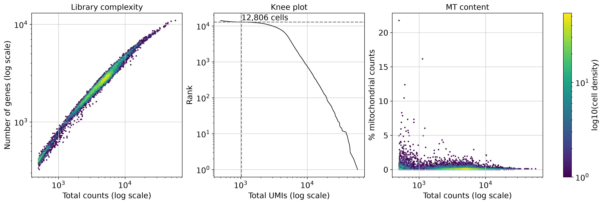</td>
  </tr>
</table>

<br>

### Identify MT outliers

After generating the `combined.h5ad` file, the next step is to annotate it with mitchondrial (MT) metrics. The `--nmads` parameters sets the number of median absolute deviations as a threshold for which to label cells as MT outliers. This outputs a new `h5ad` file in `scribble/adata`.

```bash
# Scribble: MT QC
sbatch -p uoa-compute --ntasks 1 --cpus-per-task 1 --mem 4G --time=2:00:00 \
    -o ${SCRATCH}/logs/sc_mt.%j.out -e ${SCRATCH}/logs/sc_mt.%j.err \
    scribble mt \
    --project_dir ${SCRATCH}/organoid \
    --input ${SCRATCH}/organoid/scribble/adata/combined.h5ad \
    --nmads 8
```

<br>
<table>
  <tr>
    <td>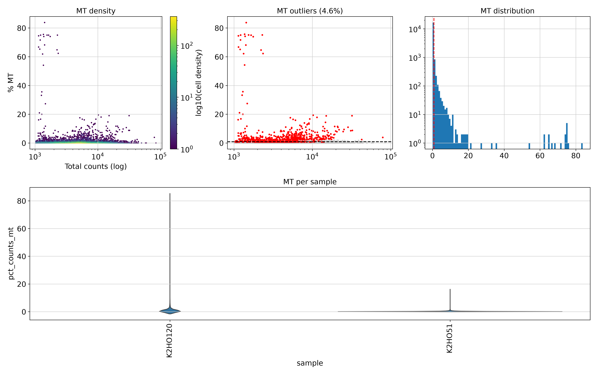</td>
  </tr>
</table>

<br>

### Identify doublets

Net we need to label doublets. Here we run `dbl` in `hybrid` mode to apply both quantile and `scrublet` methods, with an expected doublet fraction of `0.07` and minimum cell count of 200 for a sample to be processed with scrublet. This outputs a new `h5ad` file in `scribble/adata`.

```bash
# Scribble: Doublet QC
sbatch -p uoa-compute --ntasks 1 --cpus-per-task 1 --mem 32G --time=2:00:00 \
    -o ${SCRATCH}/logs/sc_dbl.%j.out -e ${SCRATCH}/logs/sc_dbl.%j.err \
    scribble dbl \
    --project_dir ${SCRATCH}/organoid \
    --input ${SCRATCH}/organoid/scribble/adata/combined_mtqc_nMADs-8.h5ad \
    --expected 0.07 \
    --mode hybrid \
    --min_cells 200
```

<br>
<table>
  <tr>
    <td>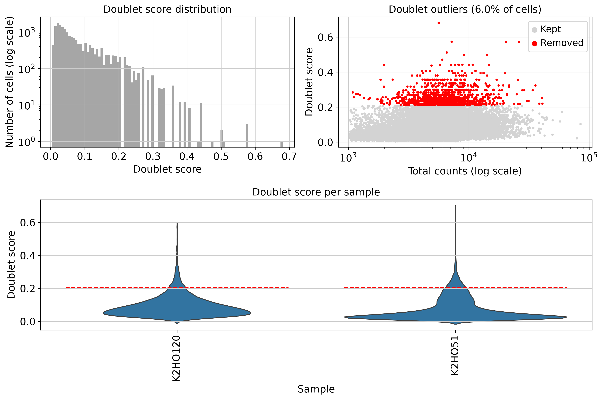</td>
  </tr>
</table>
<table>
  <tr>
    <td>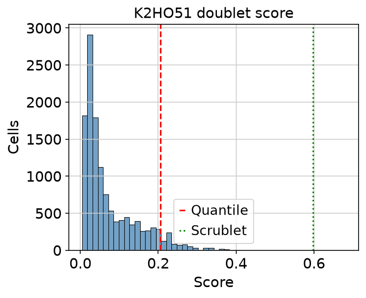</td>
    <td>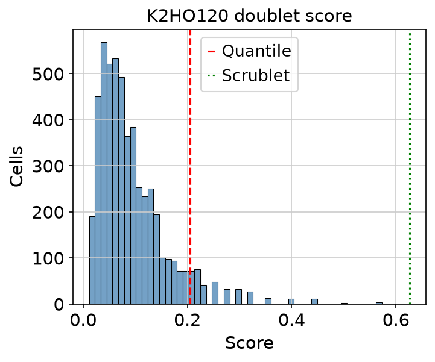</td>
  </tr>
</table>

<br>

### Visually evaluate QC effects

After annotating MT and doublets, we generate a PCA based on a subset of highly variable genes `hvgs` to visually evaluate the QC effects in PCA space. This applies filtering to remove cells labeled as MT outliers or doublets, and applies min `mingens` and max `maxgenes` thresholds to n_genes_by_counts - the number of genes where count > 0 in a cell. A low n_genes_by_counts value indicates a low quality-cell or empty droplet, whilst a very high n_genes_by_counts value can be indicative of a doublet. It returns before and after PCA plots showing log10 counts, doubelt score and %MT.

``` bash
# Scribble: PCA before/after
sbatch -p uoa-compute --ntasks 1 --cpus-per-task 1 --mem 16G --time=2:00:00 \
    -o ${SCRATCH}/logs/sc_pca.%j.out -e ${SCRATCH}/logs/sc_pca.%j.err \
    scribble pca \
    --project_dir ${SCRATCH}/organoid \
    --input ${SCRATCH}/organoid/scribble/adata/combined_mtqc_nMADs-8_dblqc_exp-0.07.h5ad \
    --mingenes 100 \
    --maxgenes 9000 \
    --hvgs 3000 \
    --vmax 0.99
```

<br>
<table>
  <tr>
    <td>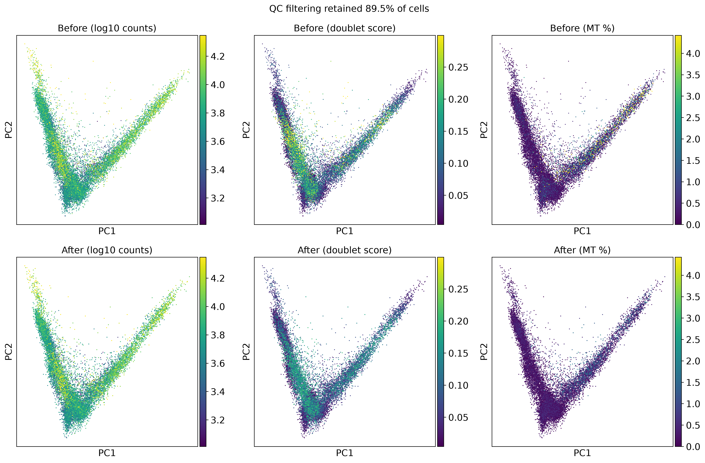</td>
  </tr>
</table>

<br>

### Apply filtering

Having reviewed the results, we next filter the data. Here we apply the same min and max gene thresholds to both samples by setting `--mingenes` and `--maxgenes`. This outputs a new `h5ad` file in `scribble/adata`.

```bash
# Filtering
sbatch -p uoa-compute --ntasks 1 --cpus-per-task 1 --mem 4G --time=2:00:00 \
    -o ${SCRATCH}/logs/sc_filter.%j.out -e ${SCRATCH}/logs/sc_filter.%j.err \
    scribble filter \
    --project_dir ${SCRATCH}/organoid \
    --input ${SCRATCH}/organoid/scribble/adata/combined_mtqc_nMADs-8_dblqc_exp-0.07.h5ad \
    --mingenes 200 \
    --maxgenes 10000
```

<bt>

### Pre-integration processing

Prior to batch interration, we run the `preintegration` tool to pre-process the data. This step preserves raw counts and metadata to avoid later loss during any transformations. It emoves genes expressed in too few cells (n = 3) to reduce noise and sparsity. It calculates HVGs, performs normalisation and log transformation and then subsets the data to the HVGs. It can optionally perform regression to remove effets of covariates, e.g. depth and %MT, and scales data to standardise gene expression (use `--no-scale` to disable). It then performs PCA, generates a KNN graph, and plots UMAP(s) cololured by the specified variables `vars`. This outputs a new `h5ad` file in `scribble/adata`.

```bash
# Pre-integration checks
sbatch -p uoa-compute --ntasks 1 --cpus-per-task 1 --mem 16G --time=2:00:00 \
    -o ${SCRATCH}/logs/sc_preintegration.%j.out -e ${SCRATCH}/logs/sc_preintegration.%j.err \
    scribble preintegration \
    --project_dir ${SCRATCH}/organoid \
    --input ${SCRATCH}/organoid/scribble/adata/combined_mtqc_nMADs-8_dblqc_exp-0.07_filtered.h5ad \
    --min_cells_per_gene 3 \
    --hvgs 3000 \
    --npcs 50 \
    --neighbors 15 \
    --regress total_counts pct_counts_mt
```

<br>
<table>
  <tr>
    <td>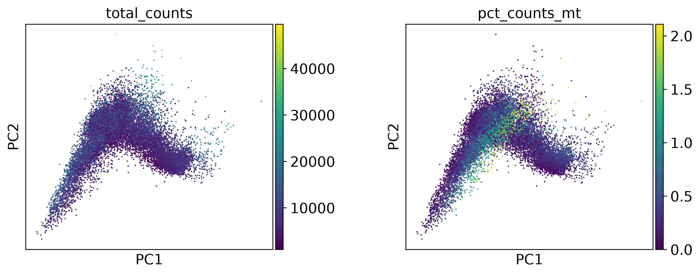</td>
  </tr>
</table>
<table>
  <tr>
    <td>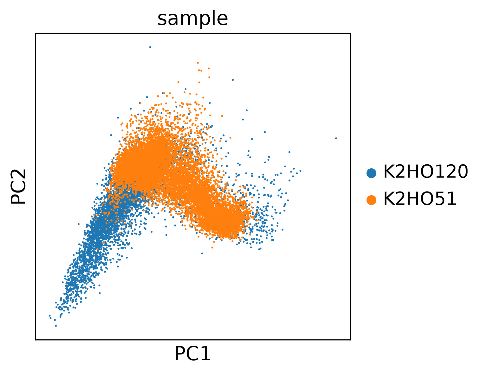</td>
    <td>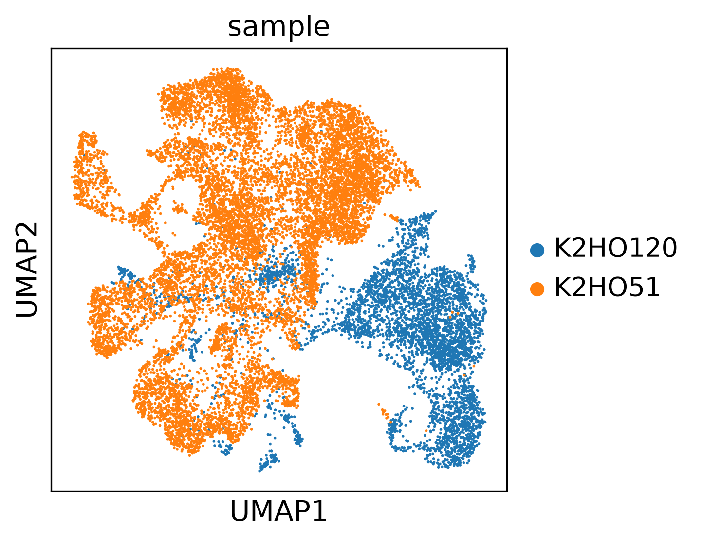</td>
  </tr>
</table>

<br>

### Batch integration

The data is then ready for batch-interation. Currently this is achieved using `Harmony`. To determine the optimal theta for a given dataset, it is necessary to repeat this process for a range of `theta` values, and is equally worth considering a range of principal components and nearest neighbours. This outputs a new `h5ad` file per combination of parameters in `scribble/adata` and umaps in `scribble/plots`.

```bash
thetas=(1 2 3)
ks=(15 20 30)
npcs=(20 30)
for theta in ${thetas[@]}
do
    for k in ${ks[@]}
    do
        for n in ${npcs[@]}
        do
            # Integration
            sbatch -p uoa-compute --ntasks 1 --cpus-per-task 1 --mem 16G --time=12:00:00 \
                -o ${SCRATCH}/logs/sc_harmony.%j.out -e ${SCRATCH}/logs/sc_harmony_%j.err \
                scribble harmony \
                --project_dir ${SCRATCH}/organoid \
                --input ${SCRATCH}/organoid/scribble/adata/combined_mtqc_nMADs-8_dblqc_exp-0.07_filtered_preintegration.h5ad \
                --npcs ${n} \
                --neighbors ${k} \
                --theta ${theta} \
                --batch sample \
                --vars sample
        done
    done
done
```

Example UMAPs following integration with `--npcs 20 --neighbours 15 --theta 1` and `--npcs 30 --neighbours 30 --theta 2` are shown below.

<br>
<table>
  <tr>
    <td>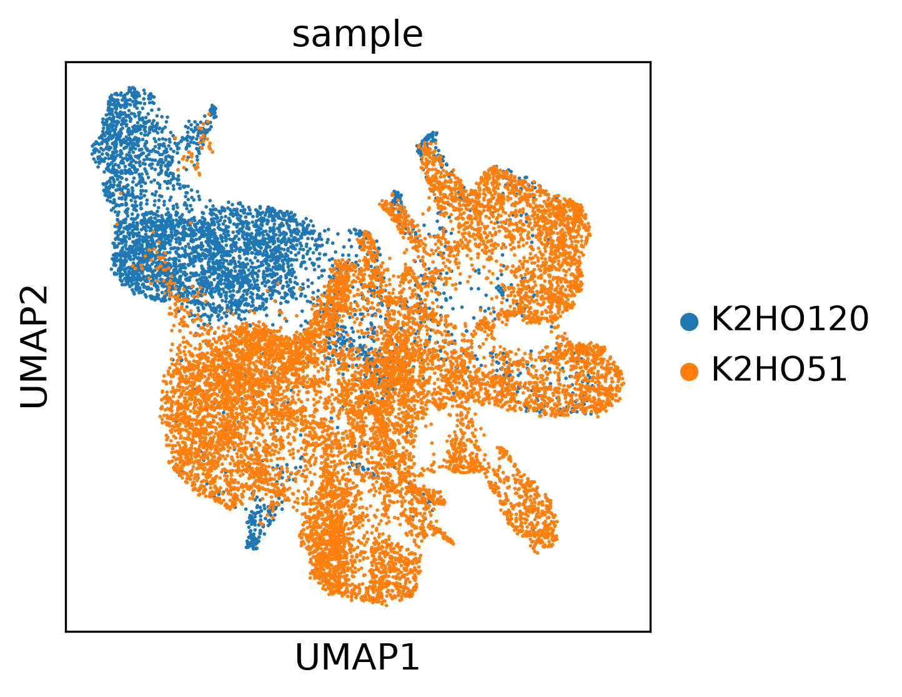</td>
    <td>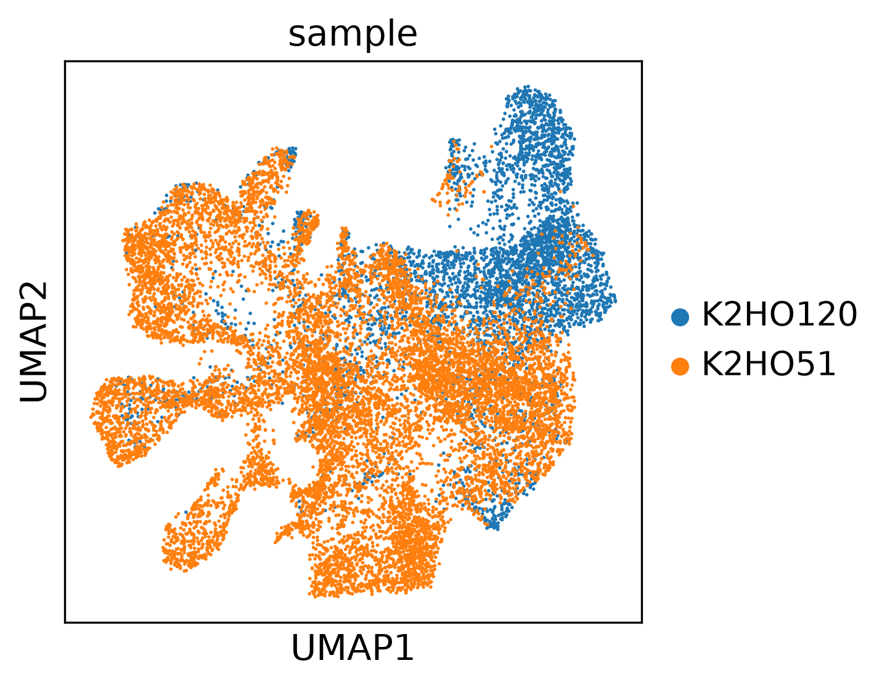</td>
  </tr>
</table>

<br>

### Clustering

Once the integration runs have completed, they are processed to perform Leiden clustering. The optimal resolution can be determined using the `--auto_resolution` method. This requires specifying the lower `--res_min` and upper `--res_max` bounds for the resolution, and the number of resolutions `--res_steps` to test within that range. A silhouette score is calculated from each run and the optimal coarse resolution determined by comparing these scores. That resolution is then used as an anchor to refine resolution based on a `--fine_width`, e.g. if the optimal coarse resolution is 1.0 and `--fine_width 0.2` with `--res_steps 10` then the fine resolution search will have a lower bound of `1.0-0.2`, an upper bound of `1.0+0.2`, and test `10` resolutions within that range. As with the coarse resolution run, silhouette score are calculated for each resolution and the optimal identified and used for clustering. Clustering is performed for `n_repeats`, and the cell to cluster stabiility recorded along with cluster entropy (sample mixing). After clustering, cluster makers are identified for the top `--nmarkers` based on Wilcoxon P value, % expression difference, and log fold change, thereby prioritising significance and specificity of the markers. Two output TSV files are written to `scribble/tables`, one containing a summary of cluster-level statistics and another containing cell-level cluster assignment stability, in addition to an Excel file containing the marker genes per cluster.

```bash
# Once integration compete, cluster
for theta in ${thetas[@]}
do
    for k in ${ks[@]}
    do
        for n in ${npcs[@]}
        do
            # Clustering on Harmony-integrated data
            sbatch -p uoa-compute --ntasks 1 --cpus-per-task 1 --mem 48G --time=6:00:00 \
                -o ${SCRATCH}/logs/sc_cluster.%j.out -e ${SCRATCH}/logs/sc_cluster_%j.err \
                scribble cluster \
                --project_dir ${SCRATCH}/organoid \
                --input ${SCRATCH}/organoid/scribble/adata/combined_mtqc_nMADs-8_dblqc_exp-0.07_filtered_preintegration_harmony_npcs-${n}_k-${k}_theta-${theta}.h5ad \
                --output_prefix combined_npcs-${n}_k-${k}_theta-${theta} \
                --embedding X_pca_harmony \
                --neighbors ${k} \
                --auto_resolution \
                --res_min 0.2 \
                --res_max 2.0 \
                --res_steps 18 \
                --fine_width 0.1 \
                --vars sample cluster_stability \
                --n_repeats 10 \
                --nmarkers 100
        done
    done
done
```

<br>

### Evaluate clustering

The resulting `cluster_summary.tsv` outputs are then imported to the `evaluate` tool. This tool evaluates clustering quality, suggests clusters to merge or subset, and outputs a decision table `cluster_summary_decisions.tsv`. Results are scored based on mean stability, mean entropy, low stabiility fraction, and a cluster penalty (if too few or too many clusters). The best score favours high stability, good mixing, few unstable clusters, and a reasonable cluster number. Clusters that could be merged prior to subsetting are determined based on total graph connectivity between cells in pairs of clusters and a percentile cutoff.

```bash
# Evaluate clustering
INPUTS=($(find ${SCRATCH}/organoid/scribble -type f -name *cluster_summary.tsv))
scribble evaluate \
    --project_dir ${SCRATCH}/organoid \
    --input ${INPUTS[@]} \
    --min_cells 100 \
    --large_cells 800 \
    --low_stability 0.75 \
    --high_stability 0.95 \
    --low_entropy 0 \
    --merge_percentile 90
```

These results indicate `--npcs 30 --neighbours 30 --theta 2` and `--npcs 30 --neighbours 30 --theta 3` to be return identical best scores. The output at command line is shown below.

```bash
Comparison summary:
                                                 file     score  mean_stability  mean_entropy  low_stability_fraction  n_clusters
10  combined_npcs-30_k-30_theta-3_cluster_summary.tsv  1.131305        0.955631      0.351348                0.000000          15
11  combined_npcs-20_k-30_theta-3_cluster_summary.tsv  1.131305        0.955631      0.351348                0.000000          15
2   combined_npcs-30_k-15_theta-1_cluster_summary.tsv  1.058591        0.929497      0.258187                0.000000          14
6   combined_npcs-20_k-15_theta-1_cluster_summary.tsv  1.058591        0.929497      0.258187                0.000000          14
9   combined_npcs-30_k-30_theta-2_cluster_summary.tsv  0.968218        0.928836      0.345431                0.066667          15
5   combined_npcs-20_k-30_theta-2_cluster_summary.tsv  0.968218        0.928836      0.345431                0.066667          15
7   combined_npcs-20_k-15_theta-3_cluster_summary.tsv  0.967169        0.920328      0.360349                0.066667          15
0   combined_npcs-30_k-15_theta-3_cluster_summary.tsv  0.967169        0.920328      0.360349                0.066667          15
1   combined_npcs-20_k-20_theta-3_cluster_summary.tsv  0.960017        0.926399      0.352950                0.071429          14
4   combined_npcs-30_k-20_theta-3_cluster_summary.tsv  0.960017        0.926399      0.352950                0.071429          14
16  combined_npcs-30_k-20_theta-2_cluster_summary.tsv  0.954379        0.916590      0.342244                0.066667          15
3   combined_npcs-20_k-20_theta-2_cluster_summary.tsv  0.954379        0.916590      0.342244                0.066667          15
14  combined_npcs-30_k-15_theta-2_cluster_summary.tsv  0.950962        0.910846      0.346899                0.066667          15
13  combined_npcs-20_k-15_theta-2_cluster_summary.tsv  0.950962        0.910846      0.346899                0.066667          15
8   combined_npcs-20_k-20_theta-1_cluster_summary.tsv  0.925784        0.916292      0.268983                0.062500          16
17  combined_npcs-30_k-20_theta-1_cluster_summary.tsv  0.925784        0.916292      0.268983                0.062500          16
12  combined_npcs-20_k-30_theta-1_cluster_summary.tsv  0.914911        0.921451      0.272634                0.071429          14
15  combined_npcs-30_k-30_theta-1_cluster_summary.tsv  0.914911        0.921451      0.272634                0.071429          14

Selected best clustering → combined_npcs-30_k-30_theta-3_cluster_summary.tsv
Score: 1.1313

Loading cluster summary: /uoa/home/s14dw4/sharedscratch/KangLab/hippocampus/organoid/scribble/tables/combined_npcs-30_k-30_theta-3_cluster_summary.tsv
Merge connectivity cutoff (90.0th percentile): 0.2085
5 <-> 1: 0.2085
MERGE 5 <-> 1 (score=0.2085)
action
keep      13
subset     2
```

The below plots from `scribble cluster` are from this highest scoring run (`--npcs 30 --neighbours 30 --theta 2`).

<br>
<table>
  <tr>
    <td>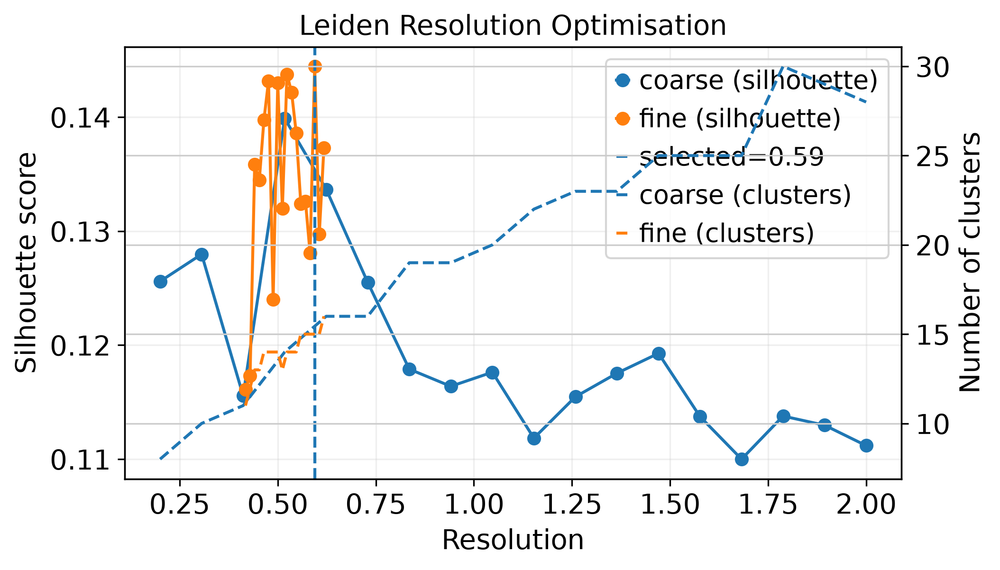</td>
  </tr>
</table>
<table>
    <tr>
    <td>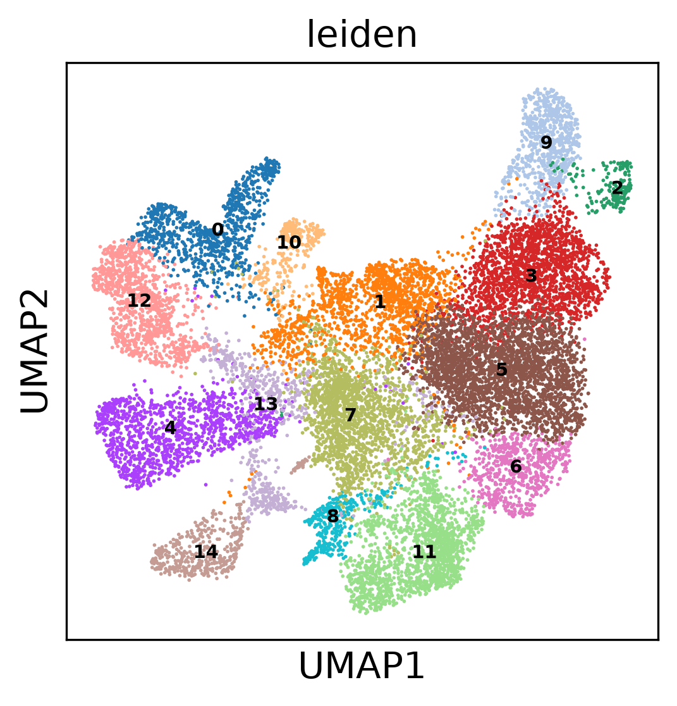</td>
    <td>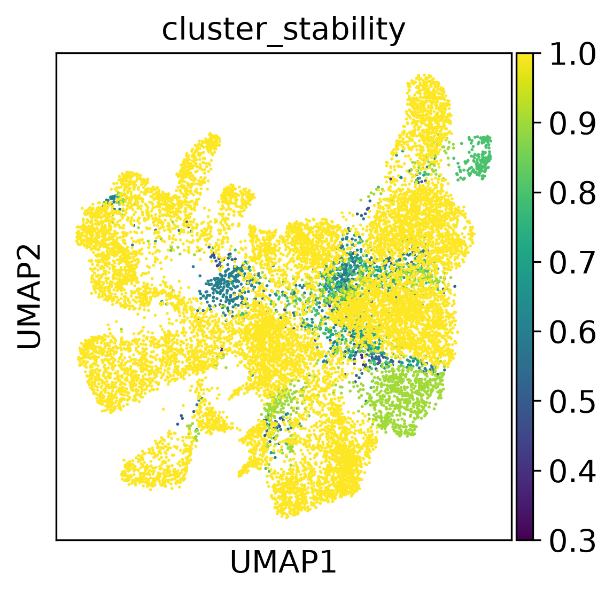</td>
  </tr>
</table>
<br>

The `cluster_summary.tsv` from `scribble cluster` for this run is below and indicates for each cluster a range of metrics. These include the number of cells, mean stability, median stability, fraction of total cells, sample cell counts, entropy, whether the cluster has low stability or low sample mixing, the clustering resolution, embedding used, and number of clustering iterations undertaken.

```tsv
cluster	n_cells	mean_stability	median_stability	fraction	K2HO120	K2HO51	sample_entropy	low_stability	low_mixing	resolution	embedding	n_repeats
5	2858	0.9162001399580126	1.0	0.17680173213733374	414	2444	0.41368250196214584	False	True	0.5941176470588234	X_pca_harmony	10
3	1962	0.950815494393476	1.0	0.12137333745746984	1787	175	0.3006706813961989	False	True	0.5941176470588234	X_pca_harmony	10
7	1861	0.9785599140247179	1.0	0.1151252706464584	231	1630	0.3750675263758072	False	True	0.5941176470588234	X_pca_harmony	10
11	1555	0.995048231511254	1.0	0.09619548407052274	10	1545	0.038864459052149816	False	True	0.5941176470588234	X_pca_harmony	10
1	1482	0.8972334682860998	1.0	0.09167955459325704	554	928	0.6609570605904523	False	False	0.5941176470588234	X_pca_harmony	10
4	1225	0.9955918367346938	1.0	0.07578100835137642	158	1067	0.3844423390137403	False	True	0.5941176470588234	X_pca_harmony	10
12	1069	0.9989710009354538	1.0	0.06613052892050728	34	1035	0.14096305673514783	False	True	0.5941176470588234	X_pca_harmony	10
0	932	0.9822961373390557	1.0	0.05765542839467987	134	798	0.4117607181637355	False	True	0.5941176470588234	X_pca_harmony	10
9	748	0.9906417112299465	1.0	0.046272811630064956	747	1	0.010182799773655687	False	True	0.5941176470588234	X_pca_harmony	10
6	618	0.8980582524271845	0.9	0.038230745437673984	190	428	0.6170397496591449	False	False	0.5941176470588234	X_pca_harmony	10
13	596	0.9734899328859061	1.0	0.0368697803897309	51	545	0.29216790639352314	False	True	0.5941176470588234	X_pca_harmony	10
14	418	0.9985645933014353	1.0	0.025858335910918653	2	416	0.030334631974982613	False	True	0.5941176470588234	X_pca_harmony	10
8	368	0.9559782608695653	1.0	0.02276523352922982	43	325	0.3605970978646161	False	True	0.5941176470588234	X_pca_harmony	10
10	295	0.9962711864406779	1.0	0.01824930405196412	77	218	0.574117928642345	False	False	0.5941176470588234	X_pca_harmony	10
2	178	0.8067415730337079	0.8	0.011011444478812249	112	66	0.6593729516471712	False	False	0.5941176470588234	X_pca_harmony	10
```

The `summary_decisions.tsv` output from `scribble evaluate` is provided below. This step classifies clusters based on the number of cells, cluster stability, and entropy. In some datasets a recommendation will be made to subset or merge clusetrs. Here it suggests to merge clustres 0 and 1 when subsetting.

```tsv
cluster	action	reason	detail	priority	merge_group
5	subset	heterogeneous_large_cluster	n=2858; stability=0.92; entropy=0.41	high	group_1
3	keep	well_defined_cluster	n=1962; stability=0.95; entropy=0.30	low
7	keep	well_defined_cluster	n=1861; stability=0.98; entropy=0.38	low
11	keep	well_defined_cluster	n=1555; stability=1.00; entropy=0.04	low
1	subset	heterogeneous_large_cluster	n=1482; stability=0.90; entropy=0.66	high	group_1
4	keep	well_defined_cluster	n=1225; stability=1.00; entropy=0.38	low
12	keep	well_defined_cluster	n=1069; stability=1.00; entropy=0.14	low
0	keep	well_defined_cluster	n=932; stability=0.98; entropy=0.41	low
9	keep	well_defined_cluster	n=748; stability=0.99; entropy=0.01	low
6	keep	well_defined_cluster	n=618; stability=0.90; entropy=0.62	low
13	keep	well_defined_cluster	n=596; stability=0.97; entropy=0.29	low
14	keep	well_defined_cluster	n=418; stability=1.00; entropy=0.03	low
8	keep	well_defined_cluster	n=368; stability=0.96; entropy=0.36	low
10	keep	well_defined_cluster	n=295; stability=1.00; entropy=0.57	low
2	keep	well_defined_cluster	n=178; stability=0.81; entropy=0.66	low
```

<br>

### Refine clustering

The `cluster_summary_decisions.tsv` file can then be parsed to refine the clustering. This fully re-processes the cells from clusters that are tagged for subset or merging. Briefly, it subsets the cells, identifies HVGs, runs normalisation, etc.., re-integration with Harmony, clustering, refines cluster labels and extracts refined markers (for each cluster subset, and globally after cluster re-assignment). To avoid over-clustering, we limit the resolution to 1.0, and recursively refine clusters to a depth no greater than 2.

```bash
# Refine clusters
sbatch -p uoa-compute --ntasks 1 --cpus-per-task 1 --mem 16G --time=2:00:00 \
    -o ${SCRATCH}/logs/sc_refine.%j.out -e ${SCRATCH}/logs/sc_refine.%j.err \
    scribble refine \
        --project_dir ${SCRATCH}/organoid \
        --decisions ${SCRATCH}/organoid/scribble/tables/combined_npcs-30_k-30_theta-3_cluster_summary_decisions.tsv \
        --input ${SCRATCH}/organoid/scribble/adata/combined_npcs-30_k-30_theta-3_clustered.h5ad \
        --min_cells_per_gene 3 \
        --hvgs 3000 \
        --npcs 20 \
        --neighbors 15 \
        --auto_resolution \
        --res_min 0.1 \
        --res_max 1.0 \
        --res_steps 10 \
        --fine_width 0.1 \
        --min_cells_per_group 100 \
        --n_repeats 10 \
        --nmarkers 100 \
        --max_refine_depth 2 \
        --stability_threshold 0.9 \
        --min_cells_per_cluster 50 \
        --marker_strength_threshold 1.0
```

This returns a UMAP with refined cluster labels in `scribble/plots`, an Excel file containing marker genes per cluster in `scribble/tables`, and a refined.h5ad file in `scribble/adata`. These files should be used for annotation, any further refinement of clusters after considering marker genes will need to be performed manually in Python.

<br>
<table>
  <tr>
    <td>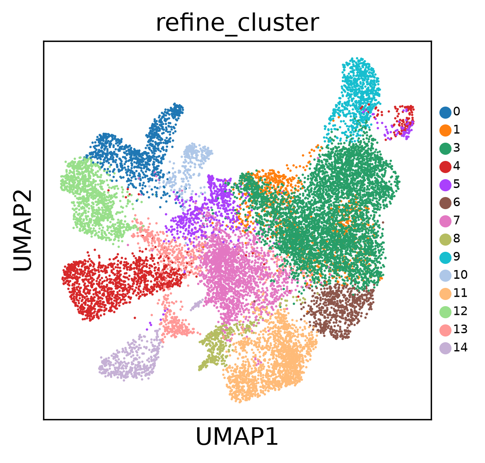</td>
  </tr>
</table>
<br>

### Update with annotations

Cluster annotations should be recorded on an `annotations` worksheet in the Excel file. The worksheet must include a field for `refine_cluster` which should contain values matching the clusters on the refine_cluster UMAP. Additional fields, such as cell type and key markers will be added as metadata. UMAPs and dot plots can be generated based on these values if the corresponding field name is passed to `--plot_markers`. The tool will output a new h5ad file in `scribble/adata` that includes the annotations from the Excel file.

```bash
# Annotate
sbatch -p uoa-compute --ntasks 1 --cpus-per-task 1 --mem 24G --time=1:00:00 \
    -o ${SCRATCH}/logs/sc_annotate.%j.out -e ${SCRATCH}/logs/sc_annotate_%j.err \
    scribble annotate \
        --project_dir ${SCRATCH}/organoid \
        --input ${SCRATCH}/organoid/scribble/adata/combined_npcs-30_k-30_theta-3_clustered_refined.h5ad \
        --annotations ${SCRATCH}/organoid/scribble/samples.xlsx \
        --plot_markers key_markers \
        --label cell_type_minor
```
